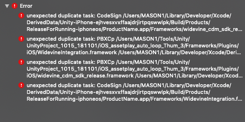
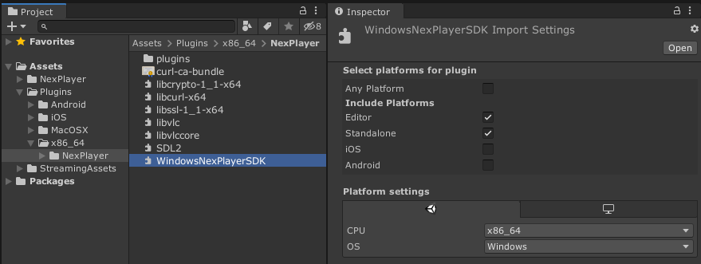
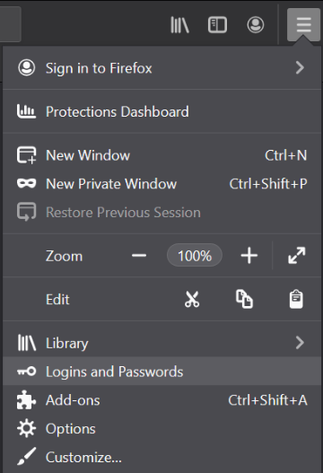
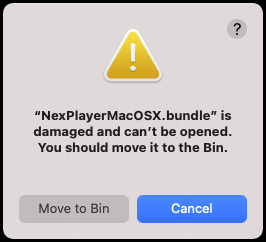

# FAQ

- **Question:** Why is the player crashing when deploying on iOS with an *EXC_BAD_ACCESS* error on Xcode?
    - **Answer:** Xcode debugging is not supported while opening Widevine content. To prevent it, you can either unplug the device from the mac or stop the app on Xcode and open it manually on the iOS device.

    

- **Question:** How do I solve the problem below when building my project on iOS?
    - **Answer:** When you build your iOS project in the Unity Editor, create a new Xcode project, or if you want to overwrite your old project, check the ‘Enable replace' checkbox and then select the option ‘Replace'

    

    

    

- **Question:** Why is the video not working on the Windows Unity Editor?
    - **Answer:** This occurs when the Unity Editor platform is not specified in the Windows NexPlayer™ DLL. It should be specified as shown in the Answer Image. If you do not have the Windows NexPlayer™ DLL, you need to re-import the package and check if the dll exists

    

- **Question:** Why can't I play DRM content when I build my app on Android?
    - **Answer:** To allow any remote video on Android, the option ‘Internet Access' needs to be set to ‘Require' in the Unity player settings and the option ‘Write Permission' should be set to External (SD Card). This configuration is needed to save the DRM certification data on the Android SDCard

    

- **Question:** Does the player support Widevine Auto License Renewal? How does it work?
    - **Answer:** Yes, our player supports that feature. Widevine Auto License Renewal is related to the server side. The server sends a 'message' event and if there is a renewal event in the message, then the license renewal is triggered by the Widevine CDM and initiates the ‘message' event. The Widevine license validity is extended when the renewal event is triggered. There isn't a notable difference in the player's behaviour

- **Question:** Would I be able to load my videos from Streaming Assets if I enable the option Split Application Binary?
    - **Answer:** Yes, Split Application Binary is compatible with our player

**Question:** Why can't I see the stream displayed on an Android device when I build a project with Unity 2019?
    - **Answer:** Review the configuration of the graphics APIs in the Project Settings. Unity sets Vulkan as the main graphics API by default. To use the NexPlayer™ Unity Plugin, you must select OpenGL ES3 as the main graphics API. Change the order or delete the Vulkan API option to solve this issue

    

- **Question:** Does the NexPlayer™ Unity Plugin support license files to verify the app ID?
    - **Answer:** Yes, let us know if your app needs this feature and we will provide you with a specific SDK that supports it

- **Question:** I have the error shown in the Question Image and I can't run the app.
    - **Answer:** There are missing compilation tools on the version of Visual Studio that you are using. Please restore or reinstall Visual Studio to solve this issue. Additionally, you may need to add C++ gaming components to your Visual Studio installation components.

    

    

- **Question:** Why is the editor crashing on Windows whenever I hit "Play"?
    - **Answer:** First, check your license timeout. This can be checked by looking at the name of the package. It follows the next format: NexPlayerSDK_Unity20XX_verX.X.X.XX_Timelock_License_YYYY_MM_DD_byYYYY_MM_DD.unitypackage. 
    This is how a package whose license ends on August 30th, 2020 looks: NexPlayerSDK_Unity2019_ver1.7.6.03_Timelock_License_2020_01_01_by2020_08_30.unitypackage
    If your package's license is expired, download the updated package following these instructions.
    If this does not solve your problem, please check if your PC meets the system requirements of NexPlayer, update windows, restart your computer and try again.

- **Question:** Why does my WebGL build throw the error shown in the Question Image?
    - **Answer:** Unity's connection to your browser can sometimes fail. The best procedure in this case is rebuilding your application. Make sure to close the error tab and delete the previous build folder to avoid more fails and problems

    

- **Question:** My video frames on Firefox are flickering. How can I fix this?
    - **Answer:** This problem is due to Firefox's settings. You need to disable them in order to fix it.
    First, you need to open the options tab on your browser.
    Then, go to **General → Performance** and disable "Use recommended performance settings" and "Use hardware acceleration when available". Don't forget to close Firefox to apply these settings.

    

    

- **Question:** I've built the app in WebGL and I have the error shown in the Question Image. What is the problem?
    - **Answer:** When using Unity 2020.2 or higher, Unity is able to catch Arithmetic exceptions. These exceptions will stop the execution. To get rid of them go to Project Settings→Player→Publishing Settings and set the WebAssembly to Ignore as shown in the answer image.

    

    

- **Question:** I've built the app in WebGL with Autoplay and it doesn't start. The browser throws the warning in the Question Image. What is the problem?
    - **Answer:** Due to browser policies, in order to video autoplay the volume must be set to 0 as shown in the answer image. Mute is not needed.

    

    

- **Question:** I've built the app in WebGL and I receive many error messages saying "X is not defined". How can I fix this?
    - **Answer:** This is caused by using a WebGL template that is not compatible with the player. Instead, you should use the template included in the package or make your own template.

- **Question:** When importing the package on macOS, the pop-up shown in the Question Image shows up. How can I fix this?
    - **Answer:** This is caused by macOS failing to verify the package. To resolve it, press 'Cancel' (as many times as the pop-up appears) and then press the Unity Editor Play button to stop the execution. Then, execute the shell script located at /Packages/NexPlayerSDK/NexPlayer/Scripts/SDK/Utility/repair_macos_bundle.sh. You can do so by opening a terminal at that path and running the following command:
    sh repair_macos_bundle.sh

    

- **Question:** The video texture looks brighter or darker than the source video. How can I fix it?
    - **Answer:** This issue is caused by the render target not being configured to ignore environment lighting.

    To prevent the render target from using lighting, apply an unlit shader to the material in the 3D object where the video will be rendered.

    This unlit shader will make the material not be affected by the light.

    This shader can be created from the Unity Editor by following the next steps:

    1. Create a new Shader by right-clicking in the Unity Editor and selecting **Create → Shader → Unlit Shader**.

    2. Open the new shader with your code editor and add the **Cull Off** property in the **Subshader** section, right behind the **LOD** property.

    3. Create a new Material by right-clicking in the Unity Editor and select **Create → Material**.

    4. Select the new Material and associate the new shader to it. The new shader must be in the section Unlit of the dropdown.

    5. Select the new Material and associate the new shader to it. The new shader must be in the section Unlit of the dropdown.

