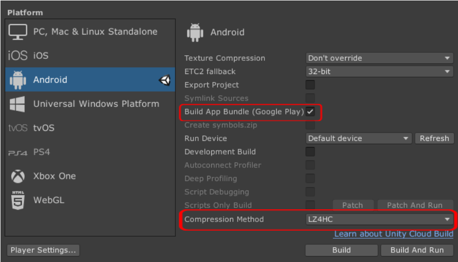
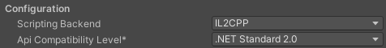
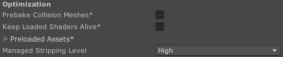
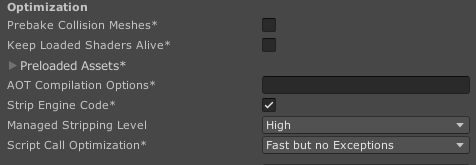
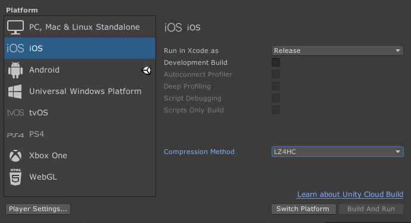

# Reducing the build file size

Application stores for Android and iOS have a limited file size to distribute the app.
The NexPlayer  Unity SDK can be reduced to occupy the minimum size possible.

It's recommended to follow the next steps to optimize the Unity SDK:

## Android

- **Check the Unity option for Build App Bundle whenever possible.**
This option will make a selective apk creation, depending on the different mobile device platforms and will not include unnecessary Plugin files in the apk. Additionally, set the compression method to **LZ4HC**.

- Remove all the unnecessary .so libraries that the Player will not need. They are located under:
	- **Packages > NexPlayer SDK (com.nexplayer.nxplayersdk) > NexPlayer > Plugins > Android > libs/arm64-v8a**
	- **Packages > NexPlayer SDK (com.nexplayer.nxplayersdk) > NexPlayer > Plugins > Android > libs/armeabi-v7a**

- The libraries **libnexplayerengine_vm.so**, **libnexcal_dolby_armv7.so** and every sample .so can be deleted without affecting the player's behaviour.

- Make sure to set **Player Settings → Other Settings → Configuration → Api Compatibility Level** to the **.NET Standard 2.0** option and **Scripting Backend** to **IL2CPP**.

- Set **Player settings → Other settings → Optimization → Managed Stripping** level to **High**. You may need to adjust this if you have runtime issues.

## iOS

- Set the **Player Settings → Other Settings → Optimization → Managed Stripping Level** to **High**, **Player Settings → Other Settings → Optimization → Script Call Optimization** to **Fast but no Exceptions** and make sure to check **Player Settings → Other Settings → Optimization → Strip Engine Code**.

- Set the Build Settings compression method to **LZ4HC**.

