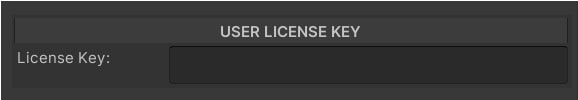
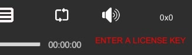
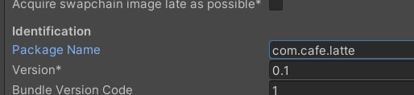

# Licensing
This feature is currently only operational on **Android & iOS Platforms**.

A remote licensing system provides streaming service for users that are under a license registered by NexPlayer. In order to authorize playback, please enter the license key which was provided to you in the License Key field shown below:

If the entered key is valid and the license that corresponds to it's currently active, the player should run without any problems.

## Licensing Errors

Any errors related to licensing are registered in full detail as Console Logs starting with the header *“Licensing Error:”* and additionally accompanied by a red error message in the player’s UI, like so:

Below are the most common errors that can be shown:

#### 1. ENTER A LICENSE KEY
> *“No license key found. Please enter a valid license key, see how to do it at doc section 'Licensing'.”* 

The License Key field is empty, so please enter in it the license key provided to you by NexPlayer. It should be under the User License Key section in the inspector. If you don’t have a key, you can contact us to request it.

#### 2. INVALID LICENSE KEY
> *“Invalid user key. Your key is not assigned to any license. Please make sure that you entered the right key or request a valid one to NexPlayer.”*  

The key is not written correctly or it’s not recorded in our database. Make sure the key exactly matches the one provided or contact us to request a valid key.

#### 3. LICENSE DISABLED
> *“License is disabled. Please request a reactivation.”*  

The license corresponding to the key entered was found, but it’s in a deactivated state which forbids its use, so please contact us to request a reactivation of your license as instructed.

#### 4. INVALID APP ID
> *“Invalid App ID. Your App ID is not supported by your license key.”*  

In the case of Android and iOS, licenses are linked to one or more App IDs, so please make sure your build is set to the allowed ones or contact us to request a modification of what App IDs should be allowed.

One way you can set this value is by navigating into Edit > Project Settings > Player and modifying the field called Package Name if the selected platform is Android or Bundle Identifier if it’s iOS. It should be under Identification in the Other Settings collapsible menu.

#### 5. TIMELOCK EXPIRED 
> *“Timelock Expired. Your key has an expired license, please request an extension.”*  

The license corresponding to the given key has already exceeded the expiration date assigned to it, so it will no longer be usable unless an extension of this date is requested.

#### 6. SERVER ERROR
> *"Bad Request”*  
> *"Internal Server Error”*  
> *"Forbidden"*

There might be a connection issue or the server could be down, so please contact us for support.
