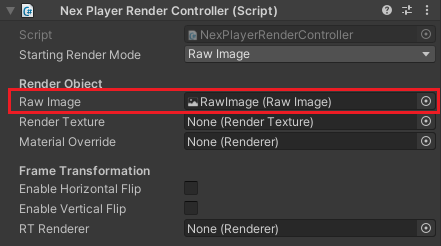

# Quick Start Guide

## NexPlayer™ Simple

NexPlayerSimple is a slimmed down version of our full-featured example player, NexPlayer.

1. To add video playback to your scene, you will need to add a NexPlayerSimple component to your scene:
	- Navigate to the NexPlayer™ menu and click “Create NexPlayer™ Simple Object”  
	
	- This will add a new GameObject (NexPlayerSimple) to your scene, which will contain the NexPlayerSimple component along with the NexPlayerRenderController component.

2. NexPlayersimple supports any of the three supported RenderModes (RawImage, RenderTexture and Material Override). Using the inspector in the NexPlayerRenderController component, select the desired Render Mode and set the reference to that Render Object:  

### Using Raw Image

1. Set the "Starting Render Mode" to Raw Image:  

2. Create a Raw Image in your scene (GameObject → UI → Raw Image) and drag and drop it onto the Raw Image field of the NexPlayerRenderController component:  

3. Start the scene and the video will play on the Raw Image.

### Using Material Override

1. Set the “Starting Render Mode” to Material Override:  

2. Create a cube in your scene (GameObject → 3D Object → Cube) and drag and drop it onto the Material Override field of the NexPlayerRenderController component:  

3. Set NexPlayerDefaultMaterial into the cube as material.  

4. Start the scene and the video will play on the cube.

### Using Render Texture

1. Set the “Starting Render Mode” to Render Texture:  

2. Create a cube in your scene (GameObject → 3D Object → Cube).
3. Create or use RenderTexture in NexPlayer Proyect (Packages → NexPlayer SDK → NexPlayer → Materials).

4. Drag Render Texture to the created cube

5. Drag and drop it onto the same Render Texture to field of the NexPlayerRenderController component:

6. Start the scene and the video will play on the cube.

## NexPlayer

NexPlayer™ is our full-featured example player.

### Setup the NexPlayer™ Video Player

The NexPlayer™ Plugin for Unity can be quickly integrated into a Unity project using the files included in the Unity package.

After importing the Unity package into your Unity project, you should perform the following steps:

1. Create the NexPlayer™ GameObjects by either using the NexPlayer™ Context Menu at the top or right clicking in the Hierarchy (Object Context Menu):  
	- “NexPlayer_Manager”
	- “NexPlayer_UI”
	- “NexPlayerSamplesController”
2. Set “NexPlayer_Manager” references to the UI elements automatically by clicking on the button “Set UI References”.
3. Select any of the different samples provided by NexPlayer™ on the “NexPlayerSamplesController”.
4. Change the NexPlayer™ component inside NexPlayer_Manager with the required stream settings.
	- Set Media Source Values (PlayMode, Url, isLiveStream, HTTP Headers and DRM).
	- Set Media Output Section Values (RenderMode and Rendering 
	- Set the Playback Properties (Autoplay, Loop…).

To display a video in your own RenderTexture object, remember to add a material to the object that contains the same texture as you referenced in the player. Standard materials can be found in Packages → NexPlayer™ SDK → NexPlayer™ → Materials.

It is recommended to refer to section [Build Configuration](/platforms/platforms.md), of the desired platform, before building the project.

### Sample Scene

The NexPlayer™ Plugin for Unity provides different samples that can be created on a blank scene through Unity’s Context Menus. Once created, it offers 10 different use cases that can be easily chosen in the NexPlayerSamplesController Inspector.  

*Context Menu 1*  
  

*Context Menu 2*  
  

*Final Hierarchy*  
  

*Use Case selection*  

- ***RawImage_Sample***: Video player using a Raw Image component to display the video through a raw image component.
- ***RenderTexture_Sample***: Video player using a Render Texture component to display the video through a static cube.
- ***Transparency***: Video player using a Render Texture component to display the video through a plane and convert a color from the video to transparent.
- ***VideoSpread_Sample***: Video player using a Render Texture component to display the video across multiple objects.
- ***MaterialOverride_Sample***: Video player using a Material Override component to display the video through a rotating cube.
- ***MultipleRenderers_Sample***: Video player using different objects that share the Material renderer to display the same video multiple times.
- ***ChangeRenderMode_Sample***: Video player that changes the render mode to display a video in all the supported renderers. Displays one render mode at the same time.
- ***360_Sample***: Video player using a Material Override component in a sphere to display the video in 360º.
- ***Multistream_RawImage_Sample***: Video player using different links and Raw Images to play multiple videos at the same time. Not supported on Windows, UWP platforms & Nintendo.
- ***Multistream_RenderTexture_Sample***: Video player using different links and Render Textures to play multiple videos at the same time. Not supported on Windows, UWP platforms & Nintendo.

## NexPlayer™ flow

In order to start using the NexPlayer™ Plugin for Unity SDK, it is good to have an understanding of the basic flow that the player needs to follow in order to work properly.

