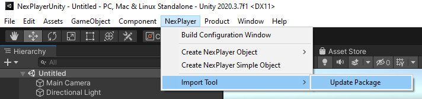

# Set Up Guide

## SDK Installation

The fully operational NexPlayer™ Plugin for Unity is provided as a Unity Package and can be imported into your Unity project.

*SDK package content*  

The NexPlayer package is composed by 3 different packages:  

- **NxPlayerSDK** that is mandatory to import to use NexPlayer.  
- **NxPlayerfullfeatsample**, which contains different samples in order to know the possibilities of NexPlayer.  
- **NxPlayersimplesample**, which contains sample scripts to know how to use the SDK.

The NexPlayer™ package supports Unity versions from 2019 upwards.

## Updating the SDK

To update the current Unity Package search in the top toolbar “NexPlayer / Import Tool” and select “Update Package”, a contextual window will appear to select the new unity package to import.  
The tool does not remove any custom files allocated on NexPlayer or WebGLTemplates.

	Important: In order to use this tool, it is necessary to have an internet connection.