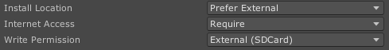
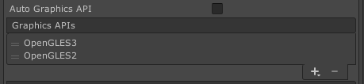
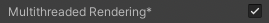

# Android

> Minimum API level: 19 (Android 4.4 KitKat).  
Minimum API level for VR features: 21 (Android 5 Lollipop).  
Supported Graphics APIs: OpenGL ES  3.0 and OpenGL ES 2.0.  

---
## Detailed Feature list
#### Media Source
- Streams (*External URL*)
	- HLS (.m3u8)
	- DASH (.mpd)
	- RTMP
	- MP4 (.mp4)
- AssetPlay (*Streaming Assets folder*)
	- MP4 (.mp4)
	- AVI (.avi)
	- MKV (.mkv)
- Local Play (*Any local folder*)
	- MP4 (.mp4)
	- AVI (.avi)
	- MKV (.mkv)

#### Rendering Mode  
- RawImage (*Unity UI*)	
- RenderTexture (*Unity Asset*)
- Material Override (*material's MainTexture*)

#### Sound Playback Control
- Volume Control
- Mute volume
- Change Audio Language

#### Video Playback Control
- Start Player
- Pause Media
- Resume Media
- Stop Media
- Close Player
- Seek
- AutoPlay
- Loop
- Maximize Screen
- Change Aspect Ratio
- Run In Background

#### Digital Rights Management
- HTTP Headers (*Streams*)
- Widevine Protection (*Streams*)
- Widevine Headers (*Streams*)
- Local DRM (*AssetPlay and LocalPlay*)

#### Subtitles
- Display WebVTT Subtitles
- Change Subtitles Language

#### Audio Codecs
- AAC-LC
- HE-AAC
- HE-AAC v2
- MP3

#### Video Codecs
- HEVC / H.265
- H.264
- VP8
- VP9
- MPEG-4

#### Advanced Features
- Initial Buffer Managing
- Track Down (Inverse ABR)
- Device Synchronization (SPD)
- Custom tags metadata
- Download Stream
- Offline Stream Playback

#### Multistream Features
- Multiple Stream Playback
- Individual Stream Playback Control
- Synchronized Multiple Streams
- Multiview

#### Miscellaneous
- 360 Media Playback
- Stereoscopic 360 Media Playback
- Video with transparency (*Chroma Shader*)
- Video Spread (*World Space Shader*)
- Play Video on multiple objects

---
## Build Configuration

The NexPlayer™ Plugin for Unity supports builds for Android applications.

To create a new APK file that includes the NexPlayer™ Plugin for Unity, the default configurations must be changed.                                                        

In order to allow remote videos on Android, the option **Internet Access** needs to be set to ‘**Require**' in the Unity player settings and the option **Write Permission** should be set to ‘**External (SD Card)**'. This configuration is needed to save DRM certification data in the Android SDCard.

These configurations can be set in the following Unity section:

**File → Build Settings → Player Settings (Android) → Other Settings**

*Required player settings*  

In order to build for the Android platform, it's also necessary to set the graphics APIs to use **OpenGLES3** as the main graphics API.

*Recommended Graphics API*  

You can either drag Vulkan below OpenGLES3 or delete it like shown in the picture above.

To enable MultiStreaming for more than 2 streams, Multithreaded Rendering must be enabled.

Then, proceed with the build normally by clicking on File → Build Settings → Build And Run. 