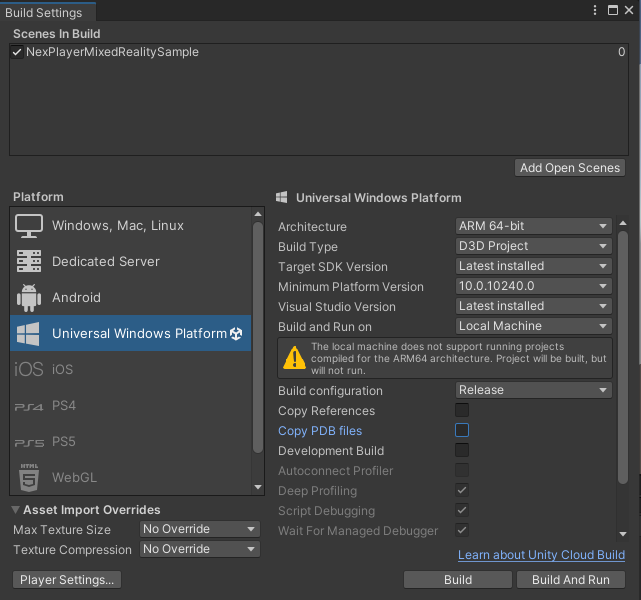
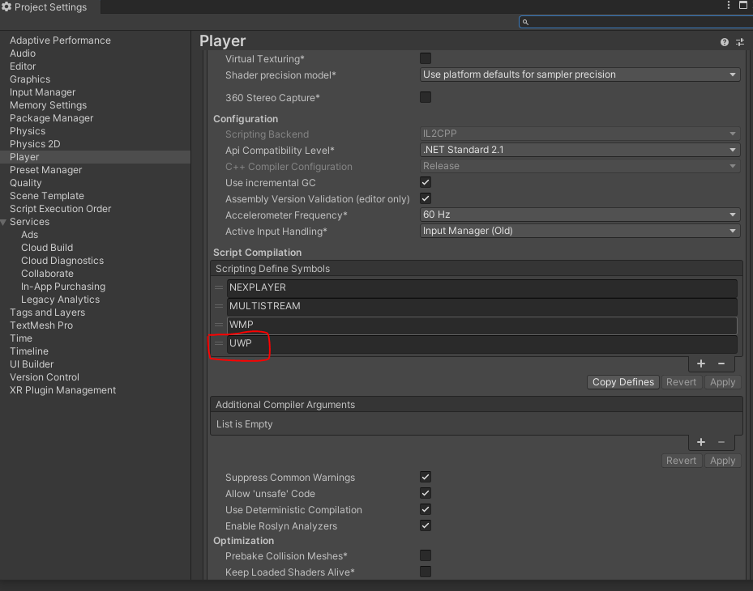
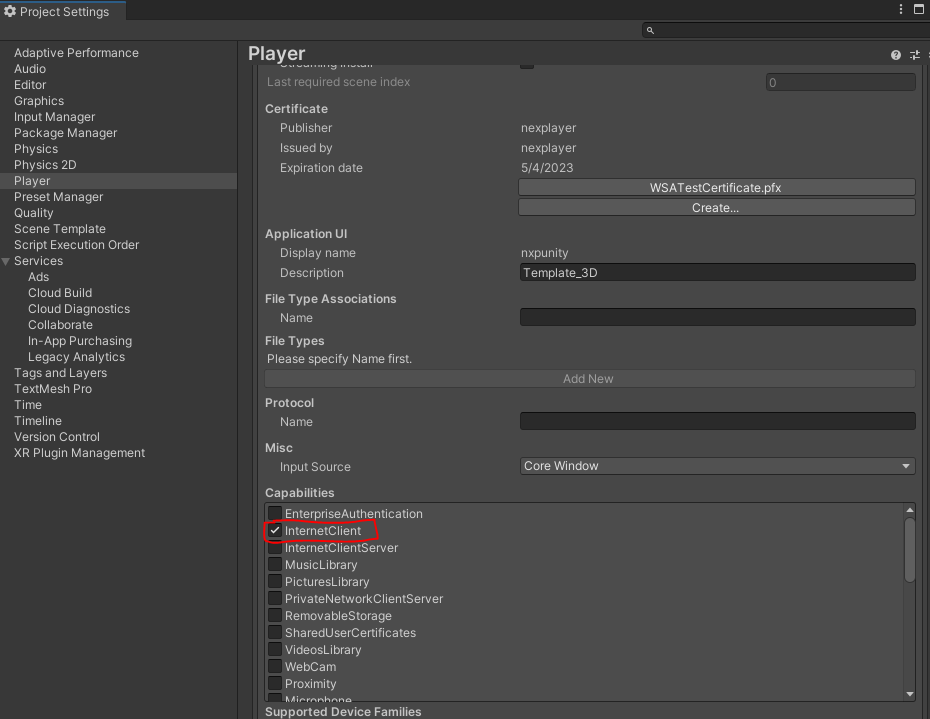
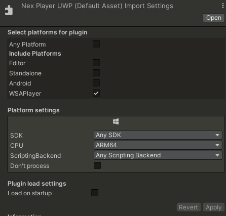
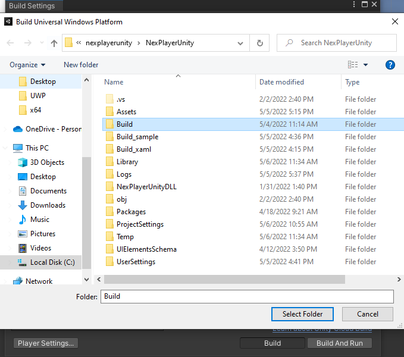
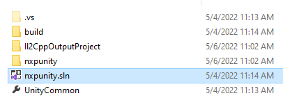

# Hololens
## Detailed feature list

#### Media Source
- Streams (*External URL*)
	- HLS (.m3u8)
	- DASH (.mpd)
	- MP4 (.mp4)
- AssetPlay (*Streaming Assets folder*)
	- MP4 (.mp4)
	- AVI (.avi)
	- MKV (.mkv)
- Local Play (*Any local folder*)
	- MP4 (.mp4)
	- AVI (.avi)
	- MKV (.mkv)

#### Rendering Mode  
- RawImage (*Unity UI*)	
- RenderTexture (*Unity Asset*)
- Material Override (*material's MainTexture*)

#### Sound Playback Control
- Volume Control
- Mute volume

#### Video Playback Control
- Start Player
- Pause Media
- Resume Media
- Stop Media
- Close Player
- Seek
- AutoPlay
- Loop
- Maximize Screen
- Run In Background

#### Miscellaneous
- 360 Media Playback
- Video with transparency (*Chroma Shader*)
- Video Spread (*World Space Shader*)
- Play Video on multiple objects

#### Audio Codecs
- AAC-LC 

#### Video Codecs
- H.264
- MPEG-4

## Build Configuration

- Build Settings → Switch Platform to Universal Windows Platform, and follow below configuration

- Player Settings → Player → Other Settings → Capabilities → Script Compilation → Add UWP macro

- Player Settings → Player → Publishing Settings → Capabilities → Check InternetClient checkbox. This is to enable our SDK to access the internet.

- Change the plugin inspector setting to target UWP and CPU to ARM64

- Create build folder in the project directory
- Build Settings → Build → Select the build folder

- It will generate new Visual Studio solution inside the Build folder. Open the .sln file

### UWP Hololens 2 Deployment

- Open the the startup project Properties
- Change Platform to ARM64
- Deploy using your preferred method (Remote Machine, Emulator)
