# Hololens
## Detailed feature list

#### Media Source
- Streams (*External URL*)
	- HLS (.m3u8)
	- DASH (.mpd)
	- MP4 (.mp4)
- AssetPlay (*Streaming Assets folder*)
	- MP4 (.mp4)
	- AVI (.avi)
	- MKV (.mkv)
- Local Play (*Any local folder*)
	- MP4 (.mp4)
	- AVI (.avi)
	- MKV (.mkv)

#### Rendering Mode  
- RawImage (*Unity UI*)	
- RenderTexture (*Unity Asset*)
- Material Override (*material's MainTexture*)

#### Sound Playback Control
- Volume Control
- Mute volume

#### Video Playback Control
- Start Player
- Pause Media
- Resume Media
- Stop Media
- Close Player
- Seek
- AutoPlay
- Loop
- Maximize Screen
- Run In Background

#### Miscellaneous
- 360 Media Playback
- Video with transparency (*Chroma Shader*)
- Video Spread (*World Space Shader*)
- Play Video on multiple objects

#### Audio Codecs
- AAC-LC 

#### Video Codecs
- H.264
- MPEG-4

## Build Configuration

This document explains how to build NexPlayer Unity Windows Media Player to target UWP for HoloLens 2 platform. To learn about how to deploy for HoloLens 2 in general, you can follow the tutorial from Microsoft [Mixed Reality Toolkit](https://docs.microsoft.com/en-us/learn/modules/learn-mrtk-tutorials/1-1-introduction)

### nexplayerunity_windows_mediaplayer

Things to check :

- Open Visual Studio Configuration Manager 
- Change Project UWP to target UWP configuration and ARM64 platform

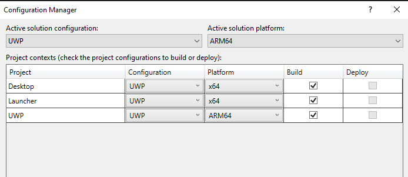

- If ARM64 doesn’t exist, select Platform → <New…> → New Platform : ARM → Copy settings from x64

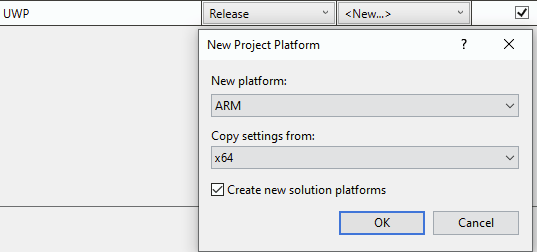

### NexPlayerUnity

#### Project SetUp

Before setting anything, make sure that you have the project configured for HoloLens. ollow this guide from Microsoft to set up the project [Unit 4](https://docs.microsoft.com/en-us/learn/modules/learn-mrtk-tutorials/1-5-exercise-configure-resources?tabs=openxr)

#### Create New Smaple for Hololens

If need to create a new sample for HoloLens follow this guide from Microsoft to build the sample cube [Unit 6](https://docs.microsoft.com/en-us/learn/modules/learn-mrtk-tutorials/1-7-exercise-hand-interaction-with-objectmanipulator)

- Add new GameObject (Cube) to the scene
- Change the Transform property to make it visible on the HoloLens camera. I use these values : 

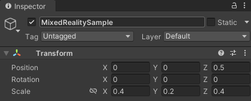

- Add scripts to the cube to make the object to be "grabbable" with tracked hands
	- Object Manipulator (Script) component
	- NearInteractionGrabbable (Script) component

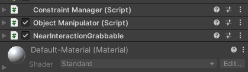

#### NexPlayer Configuration

- Create NexPlayer_Manager. We don’t need NexPlayer_UI and NexPlayer_Samples 

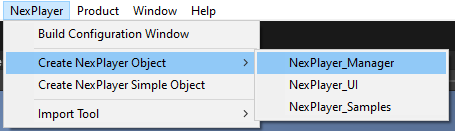

- NexPlayer_Manager → Media Output → Change Render Mode to Material Override and Target Renderer to the new Cube

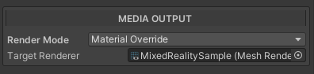

- Save the Scene

Final look:

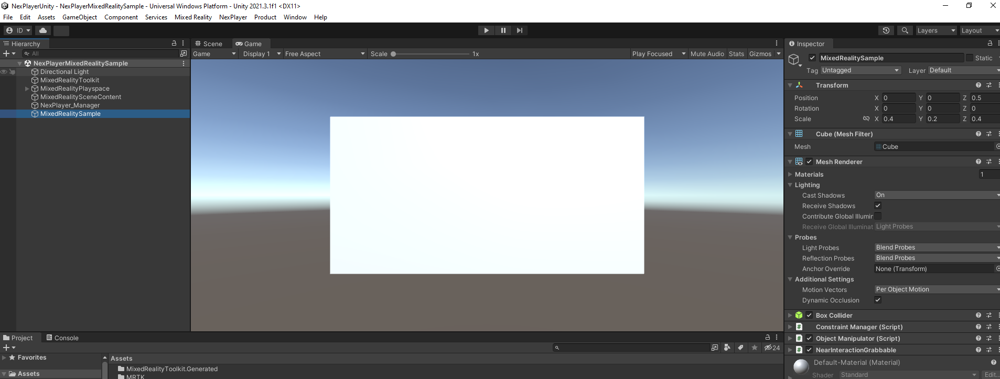

#### Build Settings

- Build Settings → Switch Platform to Universal Windows Platform, and follow below configuration

- Player Settings → Player → Other Settings → Capabilities → Script Compilation → Add UWP macro

- Player Settings → Player → Publishing Settings → Capabilities → Check InternetClient checkbox. This is to enable our SDK to access the internet.

- Change the plugin inspector setting to target UWP and CPU to ARM64 (already included in the Meta)

- Create build folder in the project directory
- Build Settings → Build → Select the build folder

- It will generate new Visual Studio solution inside the Build folder. Open the .sln file

### UWP Hololens 2 Deployment

- Open the the startup project Properties
- Change Platform to ARM64
- Configuration Properties → Debugging → Debugger to launch : Remote Machine
- Machine Name
- Fill the address with the HoloLens 2’s IP address → Select

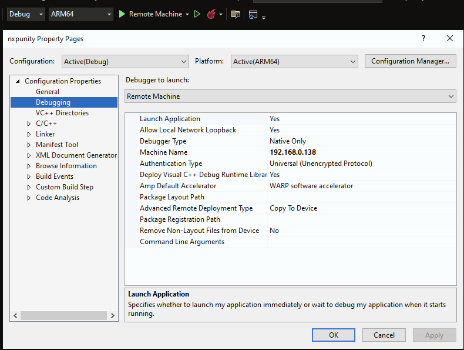

- Before building, make sure the Platform is set to ARM64 and deployment using Remote Machine.
- Click Remote Machine, it should build and load all DLLs and deploy the app to HoloLens 2
- To stop the App, you can press Stop debugging button in Visual Studio or exit the app on HoloLens 2 directly

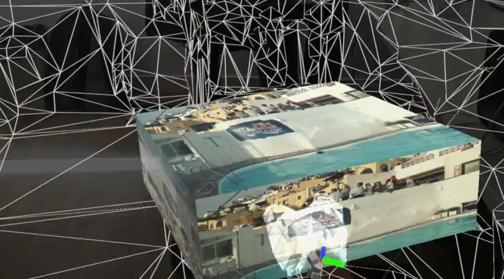

### Device Portal

To monitor performance and connect to PC, we can use the Device Portal. 

- Open Browser

- Enter the IP address of the device (e.g. 192.168.0.138)

- login

### Troubleshoot

If you have an error when building the Plugin (windows_media_player) in Visual Studio, such as : 

"Error MSB3779 The processor architecture of the project being built "ARM" is not supported by the referenced SDK "Microsoft.VCLibs, Version=14.0". Please consider changing the targeted processor architecture of your project (in Visual Studio this can be done through the Configuration Manager) to one of the architectures supported by the SDK: "x86, x64"."

Try to build the project using Visual Studio 2022 with the latest MSVC platform toolset for ARM (v143)

If you face an error when deploying the app to HoloLens 2, such as :

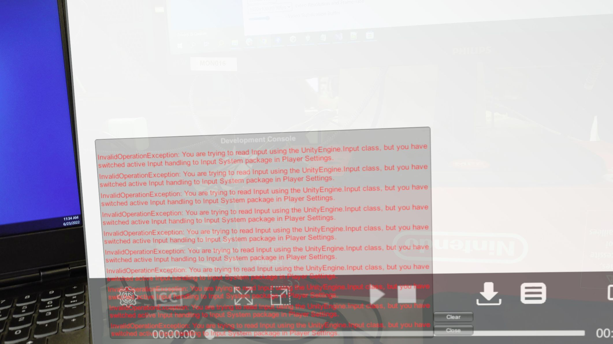

Go to Unity Player Settings → Other Settings → Configuration → Active Input Handling → Both

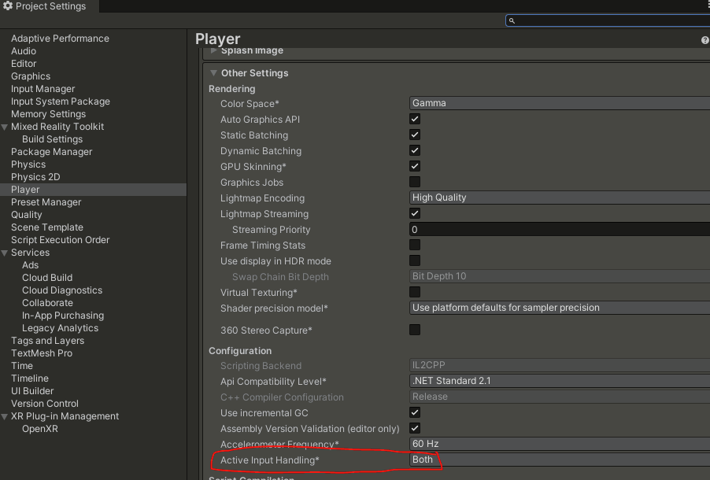