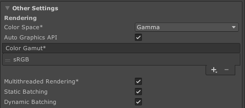
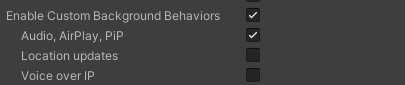
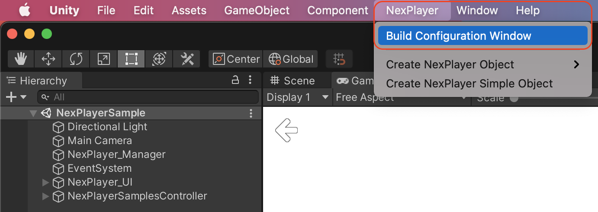
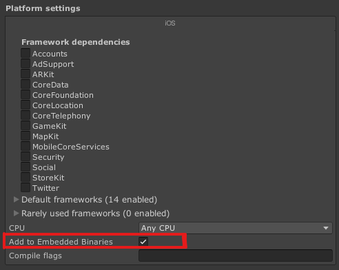
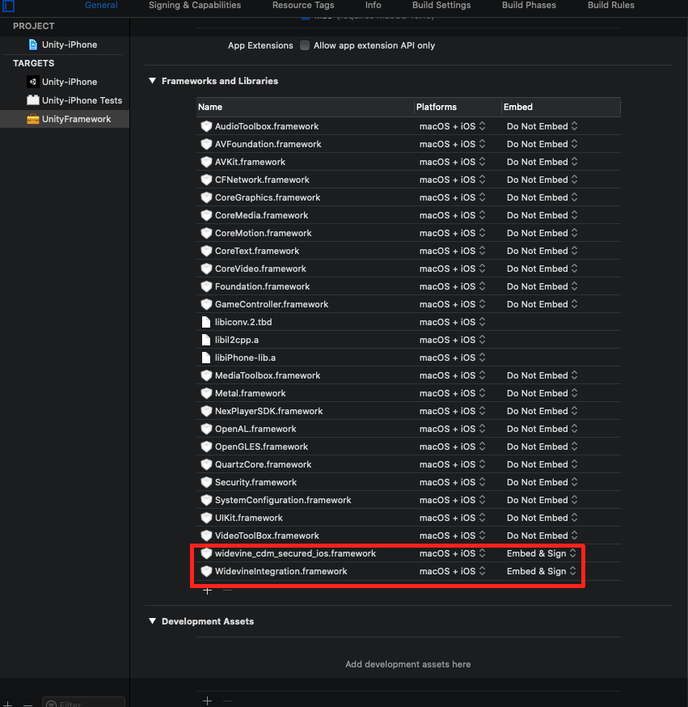
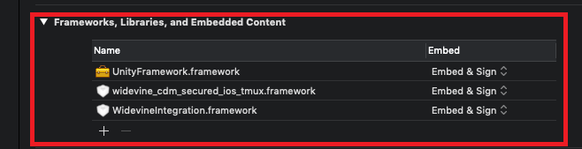
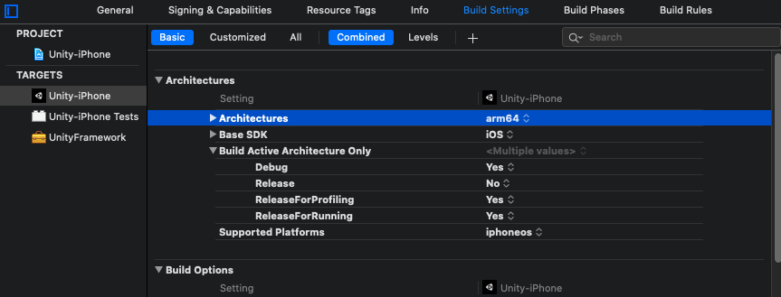

# iOS

> **Minimum API level**: iOS 11.0.  
**Minimum API level for VR features**: iOS 11.0.  
**Supported Graphics APIs**: OpenGL.    

---
## Detailed Feature list
#### Media Source
- Streams (*External URL*)
	- HLS (.m3u8)
	- DASH (.mpd)
	- RTMP
	- MP4 (.mp4)
- AssetPlay (*Streaming Assets folder*)
	- MP4 (.mp4)
	- AVI (.avi)
	- MKV (.mkv)
- Local Play (*Any local folder*)
	- MP4 (.mp4)
	- AVI (.avi)
	- MKV (.mkv)

#### Rendering Mode  
- RawImage (*Unity UI*)	
- RenderTexture (*Unity Asset*)
- Material Override (*material's MainTexture*)

#### Sound Playback Control
- Volume Control
- Mute volume
- Change Audio Language
- Speed Control
- Pitch Control
- Audio Selection Control

#### Video Playback Control
- Start Player
- Pause Media
- Resume Media
- Stop Media
- Close Player
- Seek
- AutoPlay
- Loop
- Maximize Screen
- Change Aspect Ratio
- Run In Background

#### Digital Rights Management
- HTTP Headers (*Streams*)
- WideVine Protection (*Streams*)
- WideVine Headers (*Streams*)
- Local DRM (*AssetPlay and LocalPlay*)

#### Subtitles
- Display WebVTT Subtitles
- Change Subtitles Language

#### Audio Codecs
- AAC-LC
- HE-AAC
- HE-AAC v2
- MP3

#### Video Codecs
- HEVC / H.265
- H.264
- VP8
- VP9
- MPEG-4

#### Advanced Features
- Initial Buffer Managing
- Track Down (Inverse ABR)
- Device Synchronization (SPD)
- Custom tags metadata
- Download Stream
- Offline Stream Playback

#### Multistream Features ***TODO***
- Multiple Stream Playback
- Individual Stream Playback Control
- Synchronized Multiple Streams
- Multiview

#### Miscellaneous
- 360 Media Playback
- Stereoscopic 360 Media Playback
- Video with transparency (*Chroma Shader*)
- Video Spread (*World Space Shader*)
- Play Video on multiple objects

---
## Build Configuration

The NexPlayer™ Plugin for Unity supports builds for iOS applications.

To create a new IPA file that includes the NexPlayer™ Plugin for Unity, the default configurations must be changed.  

To display HTTP videos in iOS, the option **Allow downloads over HTTP** needs to be enabled.  

It is preferable to enable the **Auto Graphics API** (AGA) option in versions of Unity that support OpenGL. 

These configurations can be set in the following Unity section:
**File → Build Settings → Player Settings (iOS) → Other Settings**

*Recommended configuration*  

Option for AGA has been removed from Unity iOS in 2020.2.x, in this case, you don't need to enable it.

In order to the application work in background is necessary enable custom background behavior and select the property “**Audio, AirPlay, PiP**”

*Recommended configuration*  

This also can be set up by using the NexPlayer’s Build Configuration Window, as shown in the picture below.

After importing the NexPlayer Unity package, some iOS frameworks have to be correctly set. Go to Packages → NexPlayer SDK → NexPlayer → Plugins → iOS.

First, select **NexPlayer.framework, widevine_cdm_secured_ios.framework,** and **WidevineIntegration.framework** and check the “iOS” and “Add to Embedded Binaries” checkboxes, as shown below, and then click on “Apply”. 

*Add to embedded binaries*  

Secondly, select **NexPlayerSDK.framework** and check the “iOS” checkbox, as shown below, and then click on “Apply”. Note that this framework must not be added to embedded binaries.

Then, proceed with the build normally by clicking on File → Build Settings → Build And Run. This will create an iOS build and open it with Xcode.

To build the application on Xcode, it is required to use **Xcode 12.0** or above.

Firstly, inside Xcode, select **UnityFramework** in the **Targets** area and select the **Embed & Sign** setting for **WidevineIntegration.framework** and **widevine_cdm_secured_ios.framework**.

*Widevine frameworks configuration*  

Verify that the section Frameworks, Libraries, and Embedded Content are set as shown in the image below:

*Section Frameworks, Libraries and Embedded Content*  

Remove **armv7** Architecture from **Unity-iPhone**, **Unity-iPhone Tests** and **UnityFramework**:

Finally, delete the NexPlayer Frameworks from the Embed Frameworks section of the **UnityFramework’s target located in the Build Phases tab**:

