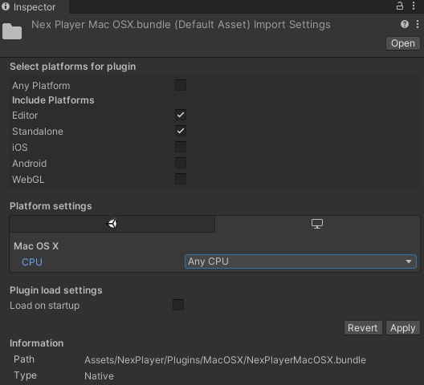
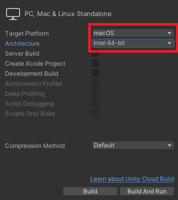

# Mac
> Minimum OS: macOS Catalina (version 10.15).  
Supported Graphics APIs: Metal.  
Supported CPU: Intel 64-bit and Apple Silicon M1 (only Unity ver. 2020 and above).  

---
## Detailed feature list

#### Media Source
- Streams (*External URL*)
	- HLS (.m3u8)
	- DASH (.mpd)
	- RTMP
	- MP4 (.mp4)
- AssetPlay (*Streaming Assets folder*)
	- MP4 (.mp4)
	- AVI (.avi)
	- MKV (.mkv)
- Local Play (*Any local folder*)
	- MP4 (.mp4)
	- AVI (.avi)
	- MKV (.mkv)

#### Rendering Mode  
- RawImage (*Unity UI*)	
- RenderTexture (*Unity Asset*)
- Material Override (*material's MainTexture*)

#### Sound Playback Control
- Volume Control
- Mute volume

#### Video Playback Control
- Start Player
- Pause Media
- Resume Media
- Stop Media
- Close Player
- Seek
- AutoPlay
- Loop
- Maximize Screen
- Run In Background

#### Miscellaneous
- Adaptive Bitrate (*ABR*)
- Progressive Download
- 360 Media Playback
- Stereoscopic 360 Media Playback
- Video with transparency (*Chroma Shader*)
- Video Spread (*World Space Shader*)
- Play Video on multiple objects

#### Subtitles
- Display WebVTT Subtitles
- Display CEA-608 Subtitles
- Change Subtitles Language

#### Audio Codecs
- AAC-LC
- MP3
- APAC

#### Video Codecs
- HEVC / H.265
- H.264
- MPEG-4

---
## Build Configuration
The NexPlayer™ Plugin for Unity supports Standalone Builds for macOS.

It's required to set the **Target Platform** as **macOS** in the Unity Build Settings configuration.

For Unity versions 2020 and above, it's possible to build for architectures: **Intel64, Apple Silicon**, or **Intel 64 + Apple Silicon**.   
In order to do this, the Package → NexPlayer™ SDK → NexPlayer™ → Plugins → MacOSX → **NexPlayerMacOSX.bundle** (in Finder: *Packages/com.nexplayer.nxplayersdk/NexPlayer/Plugins/MacOSX/NexPlayerMacOSX.bundle*), must be configured in the inspector as **Any CPU** for Standalone builds, as shown in below image:

Don’t forget to apply the changes. Then, proceed with the build process as usual by clicking on File → Build Settings → Build And Run.

For lower Unity versions, set the **Architecture** as **Intel 64-bit**, as shown in below image:

