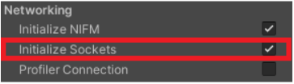
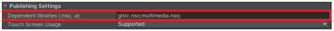

# Nintendo Switch™

> Minimum API level: Nintendo SDK version 14.3.0.

## Detailed feature list

#### Media Source
- Streams (*External URL*)
	- HLS (.m3u8)
	- DASH (.mpd)		

#### Rendering Mode  
- RawImage (*Unity UI*)	
- RenderTexture (*Unity Asset*)
- Material Override (*Material's MainTexture*)

#### Sound Playback Control
- Volume Control
- Mute Volume
- Change Audio Language

#### Video Playback Control
- Start Player
- Pause Media
- Resume Media
- Stop Media
- Close
- Seek
- AutoPlay
- Loop

#### Miscellaneous
- 360 Media Playback
- Video with transparency (*Chroma Shader*)
- Video Spread (*World Space Shader*)

#### Subtitles
- Display WebVTT Subtitles
- Display CEA-608 Subtitles
- Display CES-708 Subtitles
- Change Subtitles Language

#### Audio Codecs
- AAC
- AAC LC (Low Complexity)

#### Video Codecs
- H.264

## Build Configuration
NexPlayer requires the following build configuration for Unity to run on any Nintendo Switch™ device. To modify the build configuration, select **File → Build Settings** from the Unity Menu and inside the **Build Settings** tab, select **Player Settings**.

In the **Other Settings** tab of the **Player Settings**, it's necessary to set the **Initialize Sockets** option to **Active**.

Alternatively, the Socket Initialization can be done from code, but it's necessary to initialize the socket before the video player is created. NexPlayer  doesn't finalize the socket internally during termination to give more flexibility. Remember to finalize the socket after closing the video player and before closing your application.

**Update for NexPlayer  version 1.2.6.0 and above**  

In the **Publishing Settings** tab of the **Player Settings**, please remove the unnecessary values "**glslc.nso;multimedia.nso;**" from the **Dependent Libraries** option.

It's possible to apply this build configuration automatically by selecting NexPlayer  Build Configuration in the NexPlayer  tab at the Unity Menu: **NexPlayer → Build Configuration Nintendo Switch**.

Before building a new application on Unity, it's important to check if there's already another application running on the Nintendo Switch device.

To avoid any app execution issue, it's recommended to close the application by pressing the HOME button, then pressing the X button and confirming to close the application.

