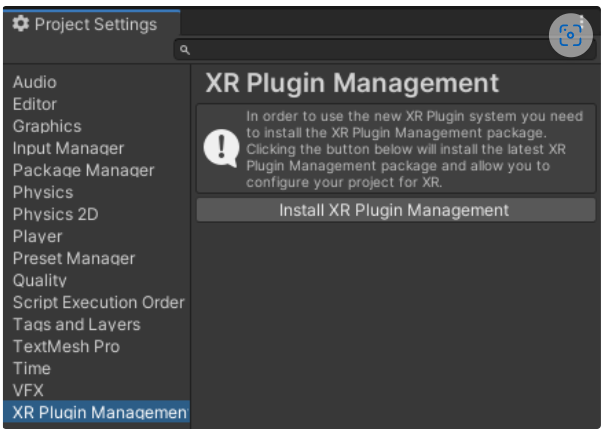
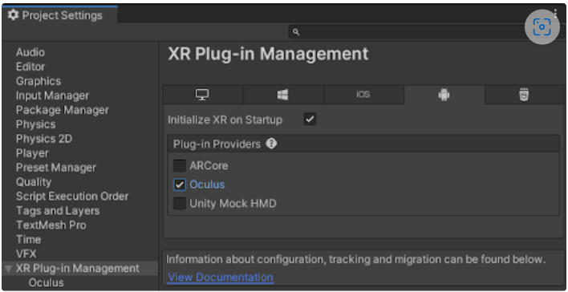
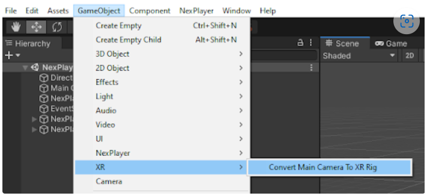

# Oculus

## Build Configuration
The NexPlayer™ Plugin for Unity supports Builds for Android in Oculust devices.

To build application in oculust is required to use XR Plugin

Go to **Project Settings → XR Plugin Management** and click the button **Install XR Plugin Management**.

Go to the **Android** section and select **Oculus** as the **Plug-in Provider**.

Now that the Oculus plugin is in place, use the context menu actions to generate an XR Rig. **GameObject → XR → Covert Main Camera to XR Rig**.

In order to use more Oculus functionality, there is a free Unity package in the Asset Store called Oculus Integration with utilities such as 3D controllers.  
Finally, follow the steps to integrate the [Android plugins](/platforms/android.md).