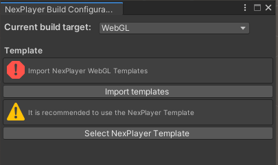

# WebGL

> Minimum browsers version, Google Chrome 75, Mozilla Firefox 67, Opera 12, Microsoft Edge 18 and Apple Safari 12.1.

---
## Detailed feature list

#### Media Source
- Streams (*External URL*)
	- HLS (.m3u8)
	- DASH (.mpd)
	- MP4 (.mp4)

#### Rendering Mode  
- RawImage (*Unity UI*)	
- RenderTexture (*Unity Asset*)
- Material Override (*material's MainTexture*)

#### Sound Playback Control
- Volume Control
- Mute volume

#### Video Playback Control
- Start Player
- Pause Media
- Resume Media
- Stop Media
- Seek
- AutoPlay
- Loop
- Maximize Screen
- Run In Background

#### Miscellaneous
- 360 Media Playback
- Video with transparency (*Chroma Shader*)
- Video Spread (*World Space Shader*)

#### Audio Codecs
- AAC-LC 
- HE-AAC
- HE-AAC v2

#### Video Codecs
- H.264
- MPEG-4

#### Browser Support
- Chrome
- Firefox
- Opera
- Edge

---
## Build Configuration
The NexPlayer™ Plugin for Unity supports Builds for WebGL applications.

To build the application with Nexplayer's Template it is required to select the template inside Unity.

In the top bar go to **NexPlayer → Build Configuration WebGL** and import the WebGL templates and select the nexplayer template as shown in the image below:



Due to browser autoplay policies the Web Build will throw a warning and will not start the playback if the **Autoplay Property** is set to true and the initial **Volume Property** is greater than 0.
In order to make the playback start automatically the initial Volume Property must be set to 0.

Then, proceed with the build normally by clicking on File → Build Settings → Build And Run.

If you want to create your own custom template, keep in mind that you need to include **nexplayer.js and nexplayerUnity.js** inside your index.html file as follows:
```csharp
<head>
<script src="https://nexplayer.nexplayersdk.com/latest/nexplayer.js" >
</script>
    <script src="https://d1s68t328djb4k.cloudfront.net/webgl/v1.0/NexPlayerUnity.js" ></script>
    <link rel="stylesheet" href="/TemplateData/style.css" />

</head>
```