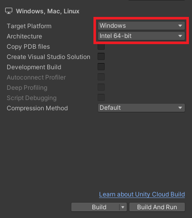
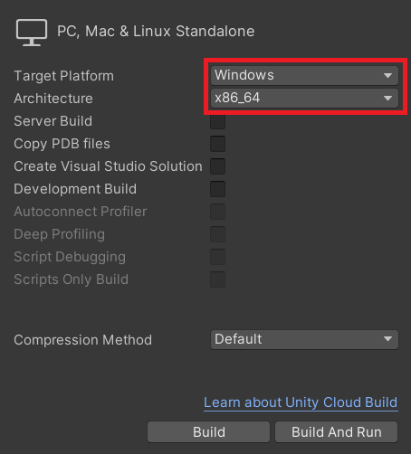
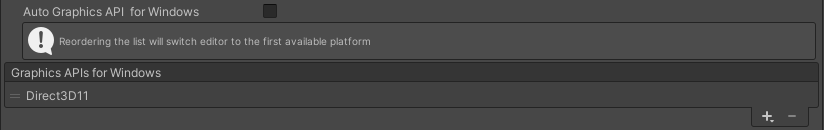

# Windows

> Minimum OS: Windows 10 using update Version 2004 and definition update KB4052623 26/08.  
Minimum CPU: Intel Core i7-4710MQ x64.  
Minimum Memory: 8GB RAM.  
Minimum GPU: NVIDIA GeForce 840M 2GB.  
Supported Graphics APIs: DirectX 11.

---
## Detailed feature list

#### Media Source
- Streams (*External URL*)
	- HLS (.m3u8)
	- DASH (.mpd)
	- RTMP
	- MP4 (.mp4)
- AssetPlay (*Streaming Assets folder*)
	- MP4 (.mp4)
	- AVI (.avi)
	- MKV (.mkv)
- Local Play (*Any local folder*)
	- MP4 (.mp4)
	- AVI (.avi)
	- MKV (.mkv)

#### Rendering Mode  
- RawImage (*Unity UI*)	
- RenderTexture (*Unity Asset*)
- Material Override (*material's MainTexture*)

#### Sound Playback Control
- Volume Control
- Mute volume

#### Video Playback Control
- Start Player
- Pause Media
- Resume Media
- Stop Media
- Close Player
- Seek
- AutoPlay
- Loop
- Maximize Screen
- Change Aspect Ratio
- Run In Background

#### Miscellaneous
- Adaptive Bitrate (*ABR*)
- Progressive Download
- 360 Media Playback
- Stereoscopic 360 Media Playback
- Video with transparency (*Chroma Shader*)
- Video Spread (*World Space Shader*)
- Play Video on multiple objects

#### Subtitles
- Display WebVTT Subtitles

#### Audio Codecs
- AAC-LC
- HE-AAC

#### Video Codecs
- H.264
- MPEG-4

---
## Build Configuration
The NexPlayer™ Plugin for Unity supports Standalone Builds for Windows.

To create a Windows Standalone program it is required to set the Target Platform as Windows and the Architecture as Intel 64-bit (Unity 2021.2) or x86_64 (Unity 2021.1 and below) in the Unity Build Settings configuration as shown in the image below:

Build settings on unity 2021.2  

Build settings on unity 2021.1 and below  

It is also necessary to disable “Auto Graphics API for Windows” and to set the graphics APIs to Direct3D11 only.

Recommended Graphics API  

Then, proceed with the build normally by clicking on File → Build Settings → Build And Run.
