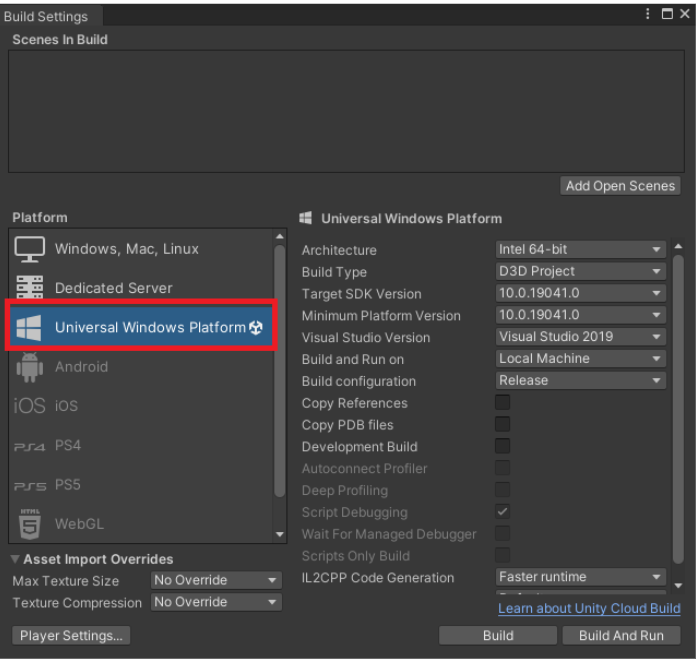
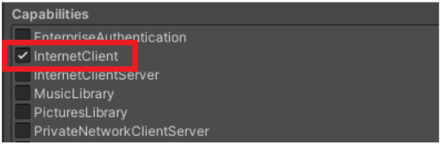
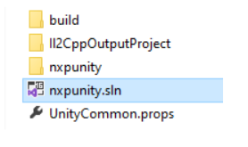
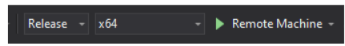

# Xbox Series X/S Build Configuration

> Minimum devices Xbox Series X/S
---
## Detailed feature list

#### Media Source
- Streams (*External URL*)
	- HLS (.m3u8)
	- DASH (.mpd)
	- MP4 (.mp4)
- AssetPlay (*Streaming Assets folder*)
	- MP4 (.mp4)
	- AVI (.avi)
	- MKV (.mkv)
- Local Play (*Any local folder*)
	- MP4 (.mp4)
	- AVI (.avi)
	- MKV (.mkv)

#### Rendering Mode  
- RawImage (*Unity UI*)	
- RenderTexture (*Unity Asset*)
- Material Override (*material's MainTexture*)

#### Sound Playback Control
- Volume Control
- Mute volume

#### Video Playback Control
- Start Player
- Pause Media
- Resume Media
- Stop Media
- Close Player
- Seek
- AutoPlay
- Loop
- Maximize Screen
- Run In Background

#### Miscellaneous
- 360 Media Playback
- Video with transparency (*Chroma Shader*)
- Video Spread (*World Space Shader*)
- Play Video on multiple objects

#### Audio Codecs
- AAC-LC 

#### Video Codecs
- H.264
- MPEG-4

---
## Build Configuration
The NexPlayer™ Plugin for Unity supports UWP Builds for Xbox Series X/S.

It is required to set the **Target Platform** as **Universal Windows Platform** in the Unity Build Settings configuration as shown in the image below:

In order to allow the UWP app to access the internet, the capability option **InternetClient** needs to be checked in the Unity player settings.

These configurations can be set in the following Unity section: 
**File → Build Settings → Player Settings (Universal Windows Platform) → Publishing Settings**

Then, proceed with the build normally by clicking on File → Build Settings → Build 
This will launch a File Explorer window asking for a destination folder. Create a folder next to the Assets directory of the project, and choose this folder as the destination folder of the build. Unity has now created a new Visual Studio solution that will be used to deploy the UWP program.

Open the newly generated solution in the build folder, and then change the target platform to **x64.** You can deploy the UWP program to Xbox by changing Target device to **Remote Machine.** 

