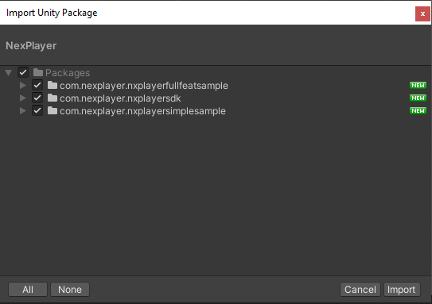
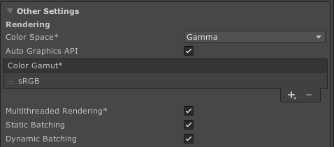
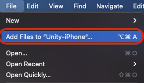
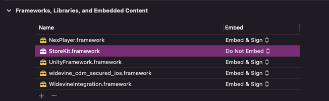
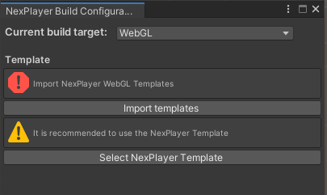
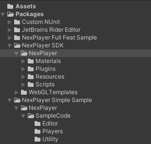

# NexPlayer SDK for Unity

## 1. Introduction

NexPlayer™ plugin for Unity is a cross-platform video streaming player for Unity games and apps that supports both standard and 360º video playback on Android, iOS, Windows, macOS, WebGL, and Nintendo Switch platforms. NexPlayer for Unity is the only video player plugin that supports Widevine DRM-protected HLS & DASH streaming on Android & iOS devices. The NexPlayer™ plugin for Unity was developed in collaboration with the native NexPlayer™ SDK. Therefore, it has access to all of its features, e.g. Adaptive Bitrate, HLS, DASH, progressive download, local playback, 360º video, and more. The plugin was built to be fast and reliable without sacrificing performance, and it has proven compatibility with international standards.


# 2. Quickstart Guide

## 2.1. Using NexPlayerSimple

NexPlayerSimple is a slimmed down version of our full-featured example player, NexPlayer.

1. To add video playback to your scene, you will need to add a NexPlayerSimple component to your scene: 
	* Navigate to the NexPlayer menu and click “Create NexPlayer Simple Object”  
    
		
    
	* This will add a new GameObject (NexPlayerSimple) to your scene, which will contain the NexPlayerSimple component along with the NexPlayerRenderController component.  
    

2.  NexPlayerSimple supports RawImage, RenderTexture and Material Override Render Modes. Using the inspector in the NexPlayerRenderController component, select the desired Render Mode and set the reference to that Render Object:  
    
	


### 2.1.1. Example: Using Raw Image

1. Set the “Starting Render Mode” to Raw Image:  
    
      
    
2. Create a Raw Image in your scene (GameObject → UI → Raw Image) and drag and drop it onto the Raw Image field of the NexPlayerRenderController component:  

	  
    
4.  Start the scene and the video will play on the Raw Image.

### 2.1.2. Example: Using Material Override

1.  Set the “Starting Render Mode” to Material Override:  

      
    
2.  Create a cube in your scene (GameObject → 3D Object → Cube) and drag and drop it onto the Material Override field of the NexPlayerRenderController component:  

      
    
3.  Set NexPlayerDefaultMaterial into the cube as material.

	
	
4.  Start the scene and the video will play on the cube.

## 2.2. Using NexPlayer

NexPlayer is our full-featured sample player.

### 2.2.1. Setup the NexPlayer™ Video Player

The NexPlayer™ Plugin for Unity can be quickly integrated into a Unity project using the files included in the Unity package.

After importing the Unity package into your Unity project, you should perform the following steps:

1. Create the NexPlayer™ GameObjects by either using the NexPlayer™ Context Menu at the top or right clicking in the Hierarchy (Object Context Menu):

	1. “NexPlayer_Manager”
	2. “NexPlayer_UI”
	3. “NexPlayerSamplesController”

2. Set “NexPlayer_Manager” references to the UI elements automatically by clicking on the button “Set UI References”.
3. Select any of the different samples provided by NexPlayer on the “NexPlayerSamplesController”.
4. Change the NexPlayer component inside NexPlayer_Manager with the required stream settings.

	1. Set Media Source Values (PlayMode, Url, isLiveStream, HTTP Headers and DRM).
	2. Set Media Output Section Values (RenderMode and Rendering GameObject).
	3. Set the Playback Properties (Autoplay, Loop…).

To display a video in your own RenderTexture object, remember to add a material to the object that contains the same texture as you referenced in the player. Standard materials can be found in Packages → NexPlayer SDK → NexPlayer → Materials.

It is recommended to refer to section 5. Build Configurations before building the project.  

### 2.2.2. Sample Scene

The NexPlayer™ Plugin for Unity provides different samples that can be created on a blank scene through Unity’s Context Menus. Once created, it offers 10 different use cases that can be easily chosen in the NexPlayerSamplesController Inspector.

Context Menu 1:


Context Menu 2:


Final Hierarchy:


Use Case selection:


#### 2.2.2.1. Use Cases

* **RawImage_Sample:** Video player using a Raw Image component to display the video through a raw image component.        

* **RenderTexture_Sample:** Video player using a Render Texture component to display the video through a static cube.          
    
* **Transparency:** Video player using a Render Texture component to display the video through a plane and convert a color from the video to transparent.          
    
* **VideoSpread_Sample:** Video player using a Render Texture component to display the video across multiple objects.          
    
* **MaterialOverride_Sample:** Video player using a Material Override component to display the video through a rotating cube.          
    
* **MultipleRenderers_Sample:** Video player using different objects that share the Material renderer to display the same video multiple times.
    
* **ChangeRenderMode_Sample:** Video player that changes the render mode to display a video in all the supported renderers. Displays one render mode at the same time.          
    
* **360_Sample:** Video player using a Material Override component in a sphere to display the video in 360º.  
    
* **Multistream\_RawImage\_Sample:** Video player using different links and Raw Images to play multiple videos at the same time. Not supported on Windows.

* **Multistream\_RenderTexture\_Sample:** Video player using different links and Render Textures to play multiple videos at the same time. Not supported on Windows.

## 2.3. NexPlayer Flow Diagram

In order to start using the NexPlayer™ Plugin for Unity SDK, it is good to have an understanding of the basic flow that the player needs to follow in order to work properly.


# 3. Capabilities and Requirements

The NexPlayer™ Plugin for Unity is compatible with all Long Term Support (LTS) Unity versions: 2020,2019, and 2018. It is also compatible with Unity Versions 2021.2.Xand 2021.1.X.

NexPlayer™ Plugin for Unity gives support for building for Android, iOS, Windows and macOS, WebGL and Nintendo Switch.

## 3.1. System Requirements

The NexPlayer™ Plugin for Unity has the following requirements for the different Operating Systems that it supports:

**Android:**

* Minimum API level: 19 (Android 4.4 KitKat).
* Minimum API level for VR features: 21 (Android 5 Lollipop).  
* Supported Graphics APIs: OpenGL ES  3.0 and OpenGL ES 2.0.

**iOS:**

* Minimum API level: iOS 11.0.
* Minimum API level for VR features: iOS 11.0.  
* Supported Graphics APIs: Metal.

**Windows:**

* Minimum OS: Windows 10 using update Version 2004 and definition update KB4052623 26/08.
* Minimum CPU: Intel Core i7-4710MQ x64.
* Minimum Memory: 8GB RAM.
* Minimum GPU: NVIDIA GeForce 840M 2GB.
* Supported Graphics APIs: Direct3D11.

**Mac:**

* Minimum OS: macOS Catalina (version 10.15).
* Supported Graphics APIs: Metal.
* Supported CPU: Intel 64-bit and Apple Silicon M1 (only Unity ver. 2020 and above).

**WebGL:**

* Minimum browser versions:
	* Google Chrome 75, 
	* Mozilla Firefox 67, 
	* Opera 12, 
	* Microsoft Edge 18 
	* Apple Safari 12.1.

## 3.2. Capabilities

| Supported VR Devices | Android | iOS |
| --- | --- | --- |
| Oculus Go | ✔   |     |
| Oculus Quest | ✔   |     |
| Oculus Quest 2 | ✔   |     |
| Google Cardboard | ✔   | ✔   |

| Video Delivery Formats | Android | iOS | Mac | Windows | WebGL | Nintendo Switch |
| --- | --- | --- | --- | --- | --- | --- |
| HLS 						| ✔   | ✔   | ✔   | ✔   | ✔ | ✔ |
| DASH 					| ✔   | ✔   |     | ✔   | ✔ | ✔ |
| Progressive Download 	| ✔   | ✔   | ✔   | ✔   | ✔ |  |
| Local Playback 		| ✔   | ✔   | ✔   | ✔   |  |  |

| Video Container Formats | Android | iOS | Mac | Windows | WebGL |
| --- | --- | --- | --- | --- | --- |
| MP4 | ✔   | ✔   | ✔   | ✔   | ✔ |
| AVI |    |    |     | ✔   |  |
| MKV | ✔   |    |    | ✔   |  |

| Video Codecs | Android | iOS | Mac | Windows | WebGL |
| --- | --- | --- | --- | --- | --- |
| H.264 / AVC 		| ✔   | ✔   | ✔   | ✔   | ✔ * |
| H.265 / HEVC		| ✔   | ✔   | ✔   |    | ✔ * |
| MPEG-4 				| ✔   | ✔   | ✔   | ✔   | ✔ * |
\* *Depends on the System*

| Audio Codecs | Android | iOS | Mac | Windows | WebGL |
| --- | --- | --- | --- | --- | --- |
| AAC-LC 				| ✔   | ✔   | ✔   | ✔   | ✔ * |
| HE-AAC				| ✔   | ✔   |     |     | ✔ * |
| HE-AACv2 			| ✔   | ✔   | ✔   |    | ✔ * |
\* *Depends on the System*

| Subtitle Formats | Android | iOS | Mac | Windows | WebGL | Nintendo Switch |
| --- | --- | --- | --- | --- | --- | --- |
| WebVTT | ✔   | ✔   | ✔   | ✔   |  | ✔   |

| Content Protection | Android | iOS | Mac | Windows | WebGL |
| --- | --- | --- | --- | --- | --- |
| Widevine | ✔   | ✔   |    |    |  |
| AES-128 | ✔   | ✔   |     |     | |

| Rendering Modes | Android | iOS | Mac | Windows | WebGL | Nintendo Switch |
| --- | --- | --- | --- | --- | --- | --- |
| RawImage<br>(Unity UI) 			| ✔   | ✔   | ✔   | ✔   | ✔ | ✔ |
| RenderTexture<br>(Unity Asset) | ✔   | ✔   | ✔    | ✔    | ✔ | ✔ |
| Material Override 			| ✔   | ✔   | ✔   | ✔   | ✔ | ✔ |

| Playback Controls | Android | iOS | Mac | Windows | WebGL | Nintendo Switch |
| --- | --- | --- | --- | --- | --- | --- |
| Start | ✔   | ✔   |   ✔ |  ✔  | ✔ | ✔ |
| Play/Pause | ✔   | ✔   |   ✔  |   ✔  |✔ | ✔ |
| Resume | ✔   | ✔   |  ✔   |   ✔  |✔| ✔ |
| Stop | ✔   | ✔   |    ✔ |    ✔ | ✔| ✔ |
| Close | ✔   | ✔   |  ✔   |   ✔  | ✔| ✔ |
| Seek | ✔   | ✔   |   ✔  |    ✔ |✔ | ✔ |
| AutoPlay | ✔   | ✔   |  ✔   |   ✔  |✔ | ✔ |
| Loop | ✔   | ✔   |   ✔  |    ✔ |  |  |
| Maximize Screen | ✔   | ✔   |✔     |   ✔  | ✔|  |
| Change Aspect Ratio | ✔   | ✔   |     |     |  |  |
| Run in Background | ✔   | ✔   |    ✔ |   ✔  | |  |
| Volume Control			| ✔   | ✔   | ✔   | ✔   | ✔ | ✔ |
| Mute Volume | ✔   | ✔   |  ✔   |   ✔  | ✔ | ✔ |
| Change Subtitle Track | ✔   | ✔   |     |     |  |  |
| Change Audio Track | ✔   | ✔   |     |    |  |  |

| Advanced Features | Android | iOS | Mac | Windows | WebGL |
| --- | --- | --- | --- | --- | --- |
| 360 Media Playback | ✔   | ✔   |  ✔  |  ✔  | ✔ |
| Stereoscopic 360 Media Playback | ✔   |  ✔  |    | ✔   |  |
| Video with Transparency (Chroma Shader) | ✔   |  ✔  | ✔    |  ✔   | ✔ |
| Video Spread (World Space Shader) | ✔   |  ✔  |  ✔  |  ✔  | ✔ |
| Play Video on multiple objects | ✔   |  ✔  |  ✔  |  ✔  | |
| HTTP Headers | ✔   | ✔   |     |     |  |
| Advanced ABR Controls | ✔  |  ✔  |     |     |  |
| Offline Playback | ✔   |    |     |     |  |
| ID3 Metadata | ✔   |  ✔  |     |  ✔   |  |
| Custom ID3 Tags | ✔   |  ✔  |     |   ✔  |  |
| Multiple Streams (Up to 5) | ✔ |   ✔ |  ✔   |     |  |
| Synchronized Multiple Streams | ✔ |  ✔  |     |     |  |

| Graphics APIs | Android | iOS | Mac | Windows | WebGL | Nintendo Switch |
| --- | --- | --- | --- | --- | --- | --- |
| Metal |    | ✔   |   ✔  |    |  |  |
| OpenGL ES 2 |  ✔ * |    |     |    |  |  |
| OpenGL ES 3 |  ✔ * |    |     |    |  |  |
| DirectX 11 |    |    |     |  ✔  |  |  |
| WebGL 1.0 |    |    |     |    | ✔ |  |
| WebGL 2.0 |    |    |     |    | ✔ |  |
| Nvn |    |    |     |    |    | ✔ |

\* *Supported architectures: arm64-v8a, armeabi-v7a and x86*

### 3.2.1 Supported Browsers for WebGL

| Browser | HLS | Dash | MP4 |
| --- | --- | --- | --- |
| Chrome | ✔   | ✔   | ✔   |
| Firefox | ✔   | ✔   | ✔   |
| Opera | ✔   | ✔   | ✔   |
| Edge | ✔   | ✔   | ✔   |
| Safari | ✔    |     | ✔   |


# 4. SDK Installation

## 4.1. Installing the Package

The fully operational NexPlayer™ Plugin for Unity is provided as a Unity Package and can be imported into your Unity project.  



The NexPlayer package is composed by 3 different packages, the NexPlayer SDK that is mandatory to import to use NexPlayer; the NexPlayer full feat sample, which contains different samples in order to know the possibilities of NexPlayer and finally the NexPlayer simple sample, which contains sample scripts to know how to use the SDK.

The NexPlayer™ package supports multiple Unity versions (2021.2.X, 2021.1.X, 2020, 2019).

#### Import NexPlayer™ into Unity 2018.X

To import NexPlayer™ into Unity 2018.X, it is also required to change Asset Serialization mode before importing the package. Go to Edit → Project Settings → Editor → Asset Serialization and select “Force Binary” or “Mixed”. After importing the package you can switch back to Force Text as required by most version control systems.


## 4.1. Updating the SDK

### 4.1.1. Updating the Package from SDK version 2.1.4 or higher

To update the current Unity Package search in the top toolbar “NexPlayer / Import Tool” and select “Update Package”, a contextual window will appear to select the new unity package to import. The tool does not destroy any custom files allocated on NexPlayer or WebGLTemplates.


Important: In order to use this tool, it is necessary to have an internet connection.

### 4.1.2. Updating the Package from SDK version 2.1.3 or below

To update the current Unity Package it is required to delete the “NexPlayer” and “WebGLTemplates” folders first, in order to prevent the Unity Editor from duplicating any files.


# 5. Build Configurations

## 5.1. Automatic Build Configuration

The NexPlayer™ Plugin for Unity provides the build configuration window to set the build configuration for each platform in a fast and easy way.  

Open the window by clicking in the top context menu NexPlayer/Build Configuration Window.


The window automatically detects and informs of any conflicts regarding the build configuration (graphics API, Internet settings...)

The following dialog will be shown if the build configuration is correct


The following warning will be displayed if the build configuration is not correctly configured. The button will change the configuration automatically:


## 5.2. Android Build Configuration

The NexPlayer™ Plugin for Unity supports builds for Android applications.

To create a new APK file that includes the NexPlayer™ Plugin for Unity, the default configurations must be changed.                                                        

In order to allow remote videos on Android, the option Internet Access needs to be set to ‘Require’ in the Unity player settings and the option Write Permission should be set to ‘External (SD Card)’. This configuration is needed to save DRM certification data in the Android SDCard.  
  
These configurations can be set in the following Unity section:

File → Build Settings → Player Settings (Android) → Other Settings


In order to build for the Android platform, it is also necessary to set the graphics APIs to use OpenGLES3 as the main graphics API:


You can either drag Vulkan below OpenGLES3 or delete it like shown in the picture above.

To enable MultiStreaming for more than 2 streams, **Multithreaded Rendering** must be enabled:


Then, proceed with the build normally by clicking on File → Build Settings → Build And Run.

## 5.3. iOS Build Configuration

The NexPlayer™ Plugin for Unity supports builds for iOS applications.

To create a new IPA file that includes the NexPlayer™ Plugin for Unity, the default configurations must be changed.

To play videos from the network on iOS, the option Allow downloads over HTTP needs to be enabled.

It is highly recommended to use the following configuration. Also, it is preferable to enable the Auto Graphics API (AGA) option in versions of Unity that support OpenGL.

This configuration can be set up by navigating to the following Unity section: File → Build Settings → Player Settings (iOS) → Other Settings



Option for AGA has been removed from Unity iOS in 2020.2.x, in case you are using this or neewer versions you don't need to enable AGA.

In order to the application work in background is necessary enable custom background behavior and select the property “Audio, AirPlay, PiP”:


This also can be set up by using the NexPlayer’s Build Configuration Window, as shown in the picture below:

  

After importing the NexPlayer Unity package, some iOS frameworks have to be correctly set. Go to Packages → NexPlayer SDK → NexPlayer → Plugins → iOS.

First, select NexPlayer.framework, widevine\_cdm\_secured\_ios\_tmux.framework, and WidevineIntegration.framework and check the “iOS” and “Add to Embedded Binaries” checkboxes, as shown below, and then click on “Apply”:

  

Secondly, select NexPlayerSDK.framework and check the “iOS” checkbox, as shown below, and then click on “Apply”. Note that this framework must not be added to embedded binaries.

Then, proceed with the build normally by clicking on File → Build Settings → Build And Run. This will create an iOS build and open it with XCode.

### 5.3.1. Build iOS with Unity 2019.X and above

To build the application on Xcode, it is required to use Xcode 12.0 or above.

Firstly, inside Xcode, select UnityFramework in the Targets area and select the Embed & Sign setting for WidevineIntegration.frameworkand widevine\_cdm\_secured_ios.framework.


Verify that the section Frameworks, Libraries, and Embedded Content are set as shown in the image below:


For iOS versions 14.3 or above, if the app crashes when trying to play a stream encrypted with Widevine DRM, the configuration settings in the Target UnityFramework in the Build Phases Tab must be changed. NexPlayer frameworks must be set in the following order:

1.  Widevine\_cdm\_secured_ios.framework
2.  WidevineIntegration.framework
3.  NexPlayerSDK.framework

The following image shows how to set the correct configuration:


Remove armv7 Architecture from Unity-iPhone, Unity-iPhone Tests and UnityFramework:


Finally, delete the NexPlayer Frameworks from the Embed Frameworks section of the UnityFramework’s target located in the Build Phases tab:


### 5.3.2. Build iOS with Unity 2018.X and below

To build the application on Xcode, it is required to use Xcode 12.0 or above.

Then, inside Xcode, delete the frameworks WidevineIntegration.framework and widevine\_cdm\_secured_ios.framework.

Finally, add it again the same frameworks following the next steps:

1.  Click on the + symbol:     


2.  Select “Add Other…” and “Add Files…” :  
    


3.  Select the folder Frameworks/Plugins/iOSand select the frameworks the frameworks WidevineIntegration.frameworkand widevine\_cdm\_secured\_ios\_tmux.framework:  
    


4.  Finally, set the frameworks to Embed & Sign:  


After adding the Widevine Frameworks, remove the armv7Architecture from Unity-iPhone, Unity-iPhone Testsand UnityFramework and add arm64 if it’s not included:


Select Unity folder and File → Add Files to…, and select UnitySharedDecls.h and UnityTrampolineCompatibility.h enabling the checkbox “Create Folder References”.

Select Unity and Add Files to Xcode




Select and add UnitySharedDecls.h and UnityTrampolineCompatibility.h


Finally, the Xcode project can be run and installed to an iOS device.

### 5.3.3. Build iOS with Unity 2022 Xcode configuration

Under Unity-iPhone  → “Frameworks, Libraries and Embedded Content”, you need to set all the frameworks in this section except "StoreKit.framework" to “Embed & Sign”:




## 5.4. Windows Build Configuration

The NexPlayer™ Plugin for Unity supports Standalone Builds for Windows.

To create a Windows Standalone program it is required to set the Target Platformas Windows and the Architecture as Intel 64-bit (Unity 2021.2)or x86_64 (Unity 2021.1 and below) in the Unity Build Settings configuration as shown in the image below:

Build settings on Unity 2021.2:


Build settings on Unity 2021.1 and below:


It is also necessary to disable “Auto Graphics API for Windows” and to set the graphics APIs to Direct3D11 only.


Then, proceed with the build normally by clicking on File → Build Settings → Build And Run.

## 5.5. MacOS Build Configuration

The NexPlayer™ Plugin for Unity supports Standalone Builds for macOS.

First, it is required to set the Target Platformas macOS in the Unity Build Settings configuration.

For Unity version 2020 and above, it is possible to build for architectures: Intel64, Apple Silicon, or Intel 64 + Apple Silicon. For this, the Packages → NexPlayer SDK → NexPlayer → Plugins → MacOSX → NexPlayerMacOSX.bundle (in the finder: Packages/com.nexplayer.nxplayersdk/NexPlayer/Plugins/MacOSX/NexPlayerMacOSX.bundle), must be configured in the inspector as Any CPU for Standalone builds, as shown in the picture below:


Don’t forget to apply the changes. Then, proceed with the build process as usual by clicking on File → Build Settings → Build And Run.

For lower Unity versions, set the Architecture as Intel 64-bit. The configuration must be set as shown in the image below:


## 5.6. WebGL Build Configuration

### 5.6.1. Build with Nexplayer’s Template

The NexPlayer™ Plugin for Unity supports Builds for WebGL applications.

To build the application with Nexplayer’s Template it is required to select the template inside Unity.

In the top bar go to NexPlayer → Build Configuration Window and import the WebGL templates and select the nexplayer template as shown in the image below: 



Then, proceed with the build normally by clicking on File → Build Settings → Build And Run.

### 5.6.2. Browser Autoplay Policy

Due to browser autoplay policies the Web Build will throw a warning and will not start the playback if the Autoplay Propertyis set to true and the initial Volume Property is greater than 0.

In order to make the playback start automatically the initial Volume Property must be set to 0.

### 5.6.3. Build with Custom Template

If you want to create your own custom template, keep in mind that you need to include nexplayer.js and nexplayerUnity.js inside your index.html file as follows:

```html
<head>
...
<script src="https://nexplayer.nexplayersdk.com/latest/nexplayer.js" >  
<script src="https://d1s68t328djb4k.cloudfront.net/webgl/v1.0/NexPlayerUnity.js" ></script>
<link rel="stylesheet" href="/TemplateData/style.css" />    
...
</head>

```
Then, follow the process detailed in the section 5.3.1 Build with Nexplayer’s Template to use NexPlayer in a custom template and build the application.

# 6. Player Integration - NexPlayerBehaviour

The NexPlayer™ Plugin for Unity API allows you to integrate the video player functionalities through code.

As of version 2.0, NexPlayer uses a redesigned architecture, with a clear entry point to the SDK, NexPlayerBehaviour.cs. Whereas before it would take several lines of code and extensive reading to control the SDK, now making your own custom player just requires inheriting from NexPlayerBehaviour.cs.

The NexPlayerBehaviour is designed to simplify the creation of custom players, with no need to add your own boilerplate code. To simplify this many requirements, like loading the plugins and setting up your license, are now handled automatically through the new behaviour. Any custom functionality can be handled by overriding the available virtual functions. By inheriting from NexPlayerBehaviour you have access to the main player variables, virtual methods to respond to internal player events, information about internal player errors and other virtual functions to extend the player’s default behaviour.

## 6.1. NexPlayerBehaviour Additional Functions:

You can also control other functionality by overriding virtual functions. When overriding a function remember to always call base.Function() and add your custom code below.

NexPlayerBehaviour is a Monobehaviour, so you can override all unity events:

* virtual void Reset()
* virtual void Awake()
* virtual void OnEnable()
* virtual void Start()
* virtual void Update()
* virtual void OnDisable()
* virtual void OnDestroy()
* virtual void OnApplicationFocus(bool focus)
* virtual void OnApplicationPause(bool pauseStatus)
* virtual void OnValidate()

If needed, make sure to create and destroy the GameObject that has the custom player component instead of enabling and disabling it.

# 7. Basic Playback

NexPlayer plays non-DRM (HLS, DASH or MP4) content by simply providing a valid URL and configuring the rendering.

## 7.1. NexPlayer API for Basic Playback

Basic variables inherited from NexPlayerBehavior:

- **public string URL**

	URL to get the media from.

- **public bool isLiveStream**

	Enable when the video to be opened is a live stream. Takes effect when Open() is called.

- **public bool autoPlay**

	When enabled the video will auto start playing. Otherwise the video will be initialized, but the playback will not start automatically, remaining paused.

- **public bool loopPlay**

	When enabled the player will restart the playback from the beginning when it reaches the end of the video content.

- **public bool mutePlay**

	When enabled the player will be muted. When disabled, the player will use volume.

- **public float volume**

	Sets the volume of the player (0 - 1).

Basic methods inherited from NexPlayerBehaviour:

- **protected virtual void InitControllers()**

	Method called prior to the player creation. Use it to initialize all the controllers needed for the custom player.

- **protected virtual void SetPreInitConfiguration()**

	Method called prior to the player creation. Use it to initialize all the variables needed for the basic playback settings such as URL, isLiveStream, autoplay, volume, etc...

## 7.2. Sample code for Basic Playback (non-DRM):

The code needs to inherit from NexPlayerBehaviour and requires the NexPlayerRendererController: The render controller must be set according to the scene’s needs. Configure the startingRenderMode and the target render object accordingly:

```csharp
[RequireComponent(typeof(NexPlayerRenderController))]  
publicclassNexPlayerSimple: NexPlayerBehaviour  
{  
 private NexPlayerRenderController renderController;  
  
 protected override void InitControllers()  
 {  
     base.InitControllers();  
  
     renderController = GetComponent<NexPlayerRenderController>();  
  
     NexRenderMode targetRenderMode = NexRenderMode.RawImage; // Change the sample's render mode  
  
     switch (targetRenderMode)  
     {  
         case NexRenderMode.RawImage:  
             // one of many ways to obtain a reference to the desired Raw Image  
             RawImage targetRawImage = FindObjectOfType<RawImage>();  
             // Set the target Raw Image  
             renderController.rawImage = targetRawImage;  
             // Set render mode to Raw Image  
             renderController.StartingRenderMode = NexRenderMode.RawImage;  
             break;  
         case NexRenderMode.RenderTexture:  
             // one of many ways to obtain a reference to the desired Render Texture  
             RenderTexture targetRenderTexture = Resources.Load<RenderTexture>;("PathToAssetInsideResources");  
             // Set the target Render Texture  
             renderController.renderTexture = targetRenderTexture;  
             // Set render mode to Render Texture  
             renderController.StartingRenderMode = NexRenderMode.RenderTexture;  
             break;  
         case NexRenderMode.MaterialOverride:  
             // one of many ways to obtain a reference to the desired Material Override  
             Renderer targetMaterialOverride = FindObjectOfType<Renderer>();  
             // Set the target Material Override  
             renderController.materialOverride = targetMaterialOverride;  
             // Set render mode to Material Override  
             renderController.StartingRenderMode = NexRenderMode.MaterialOverride;  
             break;  
         default:  
             break;  
     }  
  
     renderController.Init(this);  
 }
```

You will find the usage of this API in the code of our sample project located at Packages → NexPlayer Simple Sample → NexPlayer → SampleCode → Players → NexPlayerSimple.cs (in Finder: Packages/com.nexplayer.nxplayersimplesample/NexPlayer/SampleCode/Players/NexPlayerSimple.cs) by unfolding the “Render Mode” region.

Finally use SetPreInitConfiguration method to set your playback settings such as URL, isLiveStream, autoplay, loopPlay and volume:

```
protected overridevoidSetPreInitConfiguration()  
{  
   base.SetPreInitConfiguration();  
  
   URL = "testURL";  
   isLiveStream = false;  
  
   autoPlay = true;  	// After opening the content the player will automatically start playing it.
   loopPlay = false; 	// The player will stop when it reaches the end of the content.
   mutePlay = false; 	// The player starts with sound enabled.
   volume = 1; 			// The player starts with maximum volume.  
}
```
You will find the usage of this API in the code of our sample project located at Packages → NexPlayer Simple Sample → NexPlayer → SampleCode → Players → NexPlayerSimple.cs (in Finder: Packages/com.nexplayer.nxplayersimplesample/NexPlayer/SampleCode/Players/NexPlayerSimple.cs) by unfolding the “Basic Playback” and “Playback settings” regions.


# 8. Playback Control

The NexPlayer™ SDK provides an API that can be called to control the playback of the player.

## 8.1. NexPlayer API for Playback control

Playback control methods inherited from NexPlayerBehaviour:

- **public void Pause()**

	This function pauses the video playback if the current state of the video playback allows it.

- **public void Resume()**

	This function resumes the video playback if the current state of the video playback allows it.

- **public void TogglePlayPause()**

	This function pauses and resumes the video playback depending on the current state of the video playback.

- **public void Seek(int milliseconds)**

	Seeks in the playback, moving the playback to the specified millisecond.

- **public void Stop()**

	This function stops the video playback and cleans the information of the current video content.

	Stopping the video will interrupt the current playback and will set the current time to 0.

	To open the same content again, execute the method TogglePlayPause().

- **public AsyncToken Open()**

	This method initializes the media (video content) specified in the SetPreInitConfiguration() method.

- **public AsyncToken Close(bool forceSync = false)**

	This method ends all the work on the content currently open and terminates the SDK work. The content must be stopped before calling this method. The correct way to finish playing content is to either wait for the end of content or to call stop and wait for the stop operation to complete, then call close.

# 9. Events

The NexPlayer™ SDK provides a list of virtual methods which begin with “Event”. These allow you to provide custom behaviour to answer any NexPlayerEvent.

## 9.1. NexPlayerAPI for Events

Event triggered methods inherited from NexPlayerBehaviour:

- **protected virtual void EventTextureChanged()**

	Method triggered by the NexPlayerEvent NEXPLAYER\_EVENT\_TEXTURE_CHANGED.

	This event occurs whenever the reference to the internal texture has changed.

- **protected virtual void EventOnTime()**

	Method triggered by the NexPlayerEvent NEXPLAYER\_EVENT\_TEXTURE_CHANGED.

	This event occurs once per second. If the application is displaying the current play position, it should update it to reflect this new value.

- **protected virtual void EventTrackChanged()**

	Method triggered by the NexPlayerEvent NEXPLAYER\_EVENT\_TRACK_CHANGED.

	This event occurs whenever the track of the playback has changed.

- **protected virtual void EventInitComplete()**

	Method triggered by the NexPlayerEvent NEXPLAYER\_EVENT\_INIT_COMPLETE.

	This event occurs whenever the player has opened video content.

- **protected virtual void EventPlaybackStarted()**

	Method triggered by the NexPlayerEvent NEXPLAYER\_EVENT\_PLAYBACK_STARTED

	This event occurs whenever the player has started the playback or every time it resumes the playback.

- **protected virtual void EventPlaybackPaused()**

	Method triggered by the NexPlayerEvent NEXPLAYER\_EVENT\_PLAYBACK_PAUSED

	This event occurs whenever the player pauses the playback..

- **protected virtual void EventEndOfContent()**

	Method triggered by the NexPlayerEvent NEXPLAYER\_EVENT\_END\_OF\_CONTENT.

	This event occurs when the player reaches the end of the video content.

- **protected virtual void EventBufferingStarted(int percent)**

	Method triggered by the NexPlayerEvent NEXPLAYER\_EVENT\_BUFFERING_STARTED.

	This event occurs whenever the player has started buffering. Not supported on Windows.

- **protected virtual void EventBuffering(int percent)**

	Method triggered by the NexPlayerEvent NEXPLAYER\_EVENT\_BUFFERING.

	This event occurs while the player is buffering. Not supported on Windows.

- **protected virtual void EventBufferingEnded()**

	Method triggered by the NexPlayerEvent NEXPLAYER\_EVENT\_BUFFERING_ENDED.

	This event occurs whenever the player has finished buffering

- **protected virtual void EventStopped()**

	Method triggered by the NexPlayerEvent NEXPLAYER\_EVENT\_STOPPED.

	This event occurs whenever the playback has stopped. Not supported on Windows.

- **protected virtual void EventOpened()**

	Method triggered by the NexPlayerEvent NEXPLAYER\_EVENT\_OPENED.

	This event occurs whenever the player has closed (ended all the work on the content currently open and closed content data). Not supported on Windows.

- **protected virtual void EventClosed()**

	Method triggered by the NexPlayerEvent NEXPLAYER\_EVENT\_CLOSED.

	This event occurs whenever the player has closed (ended all the work on the content currently open and closed content data).

- **protected virtual void EventSeeked()**

	Method triggered by the NexPlayerEvent NEXPLAYER\_EVENT\_SEEKED.

	This event occurs whenever the player has finished seeking. Not supported on Windows.

- **protected virtual void EventLoading()**

	Method triggered by the NexPlayerEvent NEXPLAYER\_EVENT\_LOADING.

	This event occurs whenever the player is loading.

- **protected virtual void EventTextRender()**

	Method triggered by the NexPlayerEvent NEXPLAYER\_EVENT\_TEXT_RENDER.

	This event occurs whenever playback reaches a point in time where subtitles on any track need to be displayed or cleared.

- **protected virtual void EventTextInit()**

	Method triggered by the NexPlayerEvent NEXPLAYER\_EVENT\_TEXT_INIT.

	This event occurs when the subtitle parsing is complete. Not supported on Windows.

- **protected virtual void EventTimedMetadataRender()**

	Method triggered by the NexPlayerEvent NEXPLAYER\_EVENT\_TIMED\_METADATA\_RENDER.

	This event is called when new timed metadata is ready for display in HLS.

	Timed metadata includes additional information about the playing content that may be displayed to the user, and this information may change at different times throughout the content. Each time new metadata is available for display, this event is triggered.
	
	
- **protected virtual void EventTotalTimeChanged()**

	Method triggered by the NexPlayerEvent NEXPLAYER_EVENT_ON_TOTAL_TIME_CHANGED.
	
	This event occurs when the total time changes during the playback.
	
	Normally it’s triggered when the end of the seekable range loads further during a live stream.
	
	
- **protected virtual void EventHandleAudioPCM(int ts, float[] buff)**

	Method triggered by the NexPlayerEvent NEXPLAYER_EVENT_ON_HANDLE_EXTERNAL_PCM.
	
	This event occurs whenever there is new audio PCM data during the playback.
	
	The audio buffers are floats ranging from -1.0f to 1.0f. Only supported on Android.
	

- **protected virtual void EventUnhandled()**

	Unhandled event case. This is called when the event was not handled by other methods

- **protected virtual void Error(NexErrorCode error)**

	Method triggered by the NexPlayerEvent NEXPLAYER\_EVENT\_ERROR.

	This event is triggered when an internal error occurs. The base implementation of this method logs the error information and calls the error specific virtual function. On Windows it only supports the NexErrorCodes PLAYER\_ERROR\_TIME\_LOCKED, HAS\_NO\_EFFECT and ERROR\_MEDIA\_NOT\_FOUND.

## 9.2. Sample code for Events

The following sample code shows how to override inherited virtual methods to respond to any NexPlayer event:

```csharp
public class NexPlayerSimple: NexPlayerBehaviour  
{  
   	protectedoverridevoidSetPreInitConfiguration()
	{
		base.SetPreInitConfiguration();
		 // run any custom code  
   }
}
```

You will find the usage of this API in the code of our sample project located at Packages → NexPlayer Simple Sample → NexPlayer → SampleCode → Players → NexPlayerSimple.cs (in Finder: Packages/com.nexplayer.nxplayersimplesample/NexPlayer/SampleCode/Players/NexPlayerSimple.cs).


# 10. Errors

The NexPlayer™ SDK provides a list of virtual functions which begin with “Error”. These allow you to provide custom behaviour to answer any NexErrorCode.

## 10.1. NexPlayerAPI for Errors

Error triggered methods inherited from NexPlayerBehaviour:

- **protected virtual void ErrorTimeLocked()**

	Method triggered by the NexErrorCode PLAYER\_ERROR\_TIME_LOCKED.

	The SDK License is expired. Please contact NexPlayer to extend your license (see the section Technical Support Information).

- **protected virtual void ErrorNotActivateAppID()**

	Method triggered by the NexErrorCode PLAYER\_ERROR\_NOT\_ACTIVATED\_APP_ID.

	The current app ID is not activated for the NexPlayer SD. If you encounter this error, please contact NexPlayer to license your app ID (see the section Technical Support Information).

- **protected virtual void ErrorNetwork()**

	Method triggered by the NexErrorCode ERROR\_NETWORK\_PROTOCOL.

	Network related error. E.g. socket open fail, connect fail, bind fail, etc.

- **protected virtual void ErrorHasNoEffect()**

	Method triggered by the NexErrorCode HAS\_NO\_EFFECT.

	The same command has been called already in the same state or the command is invalid. E.g. If an open API is called while processing an open API, the engine does not regard it as an error.

- **protected virtual void ErrorInvalidSubtitle()**

	Method triggered by the NexErrorCode NEXPLAYER\_INVALID\_SUBTITLE.

	The subtitles for the video are either invalid or in an unsupported format.

- **protected virtual void ErrorInvalidSDK()**

	Method triggered by the NexErrorCode PLAYER\_ERROR\_INVALID_SDK.

	NexPlayer initialization failed because of an invalid SDK. Error while creating or initializing NexPlayer

- **protected virtual void ErrorInit()**

	Method triggered by the NexErrorCode PLAYER\_ERROR\_INIT.

	NexPlayer initialization failed. Error while creating or initializing NexPlayer.

- **protected virtual void ErrorNoLicenseFile()**

	Method triggered by the NexErrorCode PLAYER\_ERROR\_NO\_LICENSE\_FILE.

	NexPlayer initialization failed because the License File is missing.

- **protected virtual void ErrorSrcNotFound()**

	Method triggered by the NexErrorCode NEXPLAYER\_ERROR\_SRC\_NOT\_FOUND.

	The URI is not supported or not found. Make sure the URI actually exists and check that necessary permissions are set.

- **protected virtual void ErrorDRMInit()**

	Method triggered by the NexErrorCode DRM\_INIT\_FAILED.

	The content DRM initialization failed.

	E.g. Invalid KeyServer URL (License Acquisition URL).

	E.g. Invalid Widevine Headers (keys and/or values).

- **protected virtual void ErrorUnknown()**

	Method triggered by the NexErrorCode UNKNOWN.

	Internal Unknown error. E.g. When memory allocation fails for unknown reasons.

- **protected virtual void ErrorURL()**

- Method triggered by the NexErrorCode NEXPLAYER\_ERROR\_URL.

	The URL was not found.

- **protected virtual void ErrorTimeOut()**

	Method triggered by the NexErrorCode SOURCE\_OPEN\_TIMEOUT.

	There is no response from the server within 300 seconds while calling Open().

- **protected virtual void ErrorUnhandled(NexErrorCode error)**

	The error code received was not handled in Error(NexErrorCode error). This method can be overridden to answer additional error codes.

## 10.2. Sample code for errors

The following sample code shows how to override inherited virtual methods to respond to any NexPlayer error code:

```csharp
publicclassNexPlayerSimple: NexPlayerBehaviour  
{  
   	protectedoverridevoidErrorDRMInit()
	{
		base.ErrorDRMInit();  
 		// run any custom code  
   }
}
```

# 11. Widevine

NexPlayer provides the integration for Widevine encrypted content right out of the box, by inheriting from NexPlayerBehaviour.

## 11.1. NexPlayer API for Widevine

Widevine variables inherited from NexPlayerBehaviour:

- **public string keyServerURI**

	Endpoint server, which is responsible for managing and storing the key that will be used for decrypting the content segments.

- **public uint licenseRequestTimeout**

	The maximum time in seconds the player waits for the server response before returning a timeout error message. Zero means no timeout.

Widevine methods inherited from NexPlayerBehaviour:

- **public void SetWidevineHeaders(string[] keys, string[] values)**

	Optionally, NexPlayer allows sending headers within the license server request, in case they are needed to get the license key(s). It takes two string arrays, the first one contains the keys and the second the values. Both arrays must have the same size and key in position (i) must pair with the value in the same (i) position.

- **public void ClearWidevineHeaders()**

	Clear all the widevine headers and keys.

- **public bool UpdateWidevineHeaderValue(string key, string value)**

	Changes the value assigned to the given key to the given value. Returns true if the key is found and successfully set.

## 11.2. Sample code for playing Widevine content:

All widevine settings must be set before opening the player, NexPlayer provides the virtual method SetPreInitConfiguration() to do so:

```csharp
protectedoverridevoidSetPreInitConfiguration()
{

 base.SetPreInitConfiguration();  
   ...  
   #region Widevine Playback

 	// mandatory Widevine encrypted contentkey
 	ServerURI = "your key server url";  
   licenseRequestTimeout = 0;            // optional  
  
   // Only when using additional widevine headers  
   string[] wvHeaderKeys = new string[] { "key1",  "key2"};  
   string[] wvheaderValues = new string[] { "value1",  "value2"};  
   SetWidevineHeaders(wvHeaderKeys, wvheaderValues);  
   #endregion  
   ...  
}
```

You will find the usage of this API in the code of our sample project located at Packages → NexPlayer Simple Sample → NexPlayer → SampleCode → Players → NexPlayerSimple.cs (in Finder: Packages/com.nexplayer.nxplayersimplesample/NexPlayer/SampleCode/Players/NexPlayerSimple.cs) by unfolding the Widevine region.

# 12. Audio Tracks

The NexPlayer™ SDK provides the functionality to retrieve and select the Audio Tracks configured in any DASH and HLS manifest. For example, to output and change the audio from English to Spanish. This functionality is only supported in Android and iOS devices.

## 12.1. NexPlayer APIs for audio tracks

Audio track variables inherited from NexPlayerBehaviour:

- **public struct NexPlayerAudioStream**

	Struct to store information of one audio track. It contains:

	* public int id: ID of the audio track.
	* public string name: Name of the audio track if available (NAME Tag in The Manifest).
	* public string language: Language of the audio track if available  (LANGUAGE Tag in The Manifest).

Audio track methods inherited from NexPlayerBehaviour:

- **public NexPlayerAudioStream[] GetAudioStreamList()**

	Returns an array of all the possible audio tracks or null if the platform doesn't support it.

- **public virtual void SetAudioStream(NexPlayerAudioStream audioStream)**

	Sets a track to be used during the video playback. The list of possible audio tracks can be obtained with the method GetAudioStreams.


## 12.2. Sample code for audio tracks

In order to control which audio track is playing and change it in your custom player, the first step is to create a variable to save all the audio tracks extracted from the manifest. In order to be sure that the manifest has been read, you should override the virtual function EventPlaybackStarted:

```chsarp
// variable for storing the information about the audio tracks present inside the manifest  
NexPlayerAudioStream[] audioStreams;  
  
protected override void EventPlaybackStarted()  
{  
   base.EventPlaybackStarted();  
   // At this event the player has finished reading the manifest and is safe to ask for the audio tracks  
   audioStreams = GetAudioStreamList();  
}
```

Finally, create a public method to change the current audio track at runtime:

```csharp
public void SetAudioStream(int index)  
{  
   if (audioStreams == null)  
   {  
       Log("Audio Streams is null");  
       return;  
   }  
  
   if(index < 0 || index >= audioStreams.Length)  
   {  
       Log($"Requested index: {index}, is out of bounds");  
       return;  
   }  
  
   SetAudioStream(audioStreams\[index\]);  
}
```

You will find the usage of this API in the code of our sample project located at Packages → NexPlayer Simple Sample → NexPlayer → SampleCode → Players → NexPlayerMultipleLanguages.cs (in Finder: Packages/com.nexplayer.nxplayersimplesample/NexPlayer/SampleCode/Players/NexPlayerMultipleLanguages.cs).


# 13. Closed captions

The NexPlayer™ SDK supports retrieval, selection and display of closed captions configured in any DASH and HLS manifest. For example, to change the captions from English to Spanish and display them. This functionality is only supported in Android and iOS devices.

## 13.1. NexPlayer APIs for closed captions

Closed captions variables inherited from NexPlayerBehaviour:

- **public struct NexSubtitleElement**

	Struct to store all the information related to one subtitle element (one string text that must be outputted at a given playback time). The information stored is:

	* **public string caption**: Subtitle data string to be outputted.
	* **public int startTime**: Start time in milliseconds when the caption starts to show.
	* **public int endTime**: End time in milliseconds when the caption stops being shown.
	* **public string encodingType**: Caption encoding type (utf-8, utf-16, utf-16BE, euc-kr, etc..).
	* **public NexPlayer\_Caption\_Type captionType**: The caption type, a helper enum for utilities.
	* **public struct NexPlayerCaptionStream**:Struct to store one audio track’s information. It contains:
	* **public int id**: ID of the closed caption track (ID Tag in The Manifest)
	* **public string name**: Name of the closed caption track if available (NAME Tag in The Manifest).
	* **public string language**: Language of the closed caption track if available  (LANGUAGE Tag in The Manifest).

Closed captions methods inherited from NexPlayerBehaviour:

- **public virtual NexSubtitleElement GetCurrentSubtitleElement()**

	Returns the current subtitle information.

- **public virtual NexPlayerCaptionStream[] GetCaptionStreamList()**

	Returns an array of all the possible closed caption tracks or null if the platform doesn't support it.

- **public virtual void SetAudioStream(NexPlayerAudioStream audioStream)**

	Sets a closed caption track to be used during the video playback. The possible closed caption tracks can be obtained from the method GetCaptionStreamList.

## 13.2. Sample code for closed captions

Similar to the audio tracks, in order to control which closed caption track will be outputted by the player, it is necessary to declare a variable of type NexPlayerCaptionStream to store the information extracted from the manifest.This information is retrieved after the event EventPlaybackStarted. Also, create a public method for setting the desired closed caption track:
```csharp  

// variable for storing the information about the closed captions tracks present inside the manifest  
NexPlayerCaptionStream[] captionStreams;  

protected override void EventPlaybackStarted()  
{  
   base.EventPlaybackStarted();  
  
   // At this event the player has finished reading the manifest and is safe to ask for the CC tracks  
   captionStreams = GetCaptionStreamList();  
}  
  
public void SetCaptionStream(int index)  
{  
   if (captionStreams == null)  
   {  
       Log("Caption Streams is null");  
       return;  
   }  
  
   if(index < 0 || index >= captionStreams.Length)  
   {  
       Log($"Requested index: {index}, is out of bounds");  
       return;  
   }  
  
   SetCaptionStream(captionStreams\[index\]);  
}
```

In order to render the captions during the playback, use the struct NexSubtitleElement and override the function EventTextRender:

```csharp
// variable for holding one subtitle element at a time  
NexSubtitleElement subtitleElement;  
  
protected override void EventTextRender()  
{  
   base.EventTextRender();  
   // get information about the string that must be shown  
   subtitleElement = GetCurrentSubtitleElement();  
   if (subtitleElement.caption != null)  
   {  
       // show the string by assigning it to a Unity UI text element  
       captionLabel.text = subtitleElement.caption;  
   }  
}
```

You will find the usage of this API in the code of our sample project located at Packages → NexPlayer Simple Sample → NexPlayer → SampleCode → Players → NexPlayerMultipleLanguage.cs (in Finder: Packages/com.nexplayer.nxplayersimplesample/NexPlayer/SampleCode/Players/NexPlayerMultipleLanguages.cs).


# 14. Synchronization

NexPlayer synchronization technology allows you to sync the video arrival and stream video synchronously across different devices using the DASH SPD value. This is also possible for HLS streams by controlling the SPD value from the client-side.

## 14.1. NexPlayer API for synchronization

Synchronization variables inherited from NexPlayerBehavior:

- **public bool SynchronizationEnable**

	Enables or disables the use of synchronization to UTC time (SPD).

- **public uint DelayTime**

	Presentation delay to synchronize end users, it sets a latency between the original stream and the player’s arrival.

- **public uint SpeedUpSyncTime**

	Maximum time that the playback is allowed to be out of synchronization before it changes playback speed to get synchronized again with the latency set in the Delay Time.

- **public uint JumpSyncTime**

	Maximum time that the playback is allowed to be out of synchronization before it jumps to synchronize the video with the latency set in the Delay Time.

## 14.2. Sample code for synchronization

Synchronization technology (SPD) is meant to be used with live streaming content only. After setting a live content URL just set the synchronization variables inherited from NexPlayerBehaviour, and synchronization technology will automatically be triggered. The variables must be set prior to the player initialization, so use the method SetPreInitConfiguration to do so:

```csharp
protected override void SetPreInitConfiguration()  
{  
   base.SetPreInitConfiguration();  
  
   URL = "yourlivecontentURL";  
  
   // enable Synchronization functionality  
   SynchronizationEnable = true;  
  
   // set the presentation delay to one second
   DelayTime = 1000;  
  
   // set the max time out of synchronization to trigger speed up
   SpeedUpSyncTime = 500;  
  
   // set the max time out of synchronization to trigger seeking
   JumpSyncTime = 1000;  
}
```

You will find the usage of this API in the code of our sample project located at Packages → NexPlayer Simple Sample → NexPlayer → SampleCode → Players → NexPlayerSimple.cs (in Finder: Packages/com.nexplayer.nxplayersimplesample/NexPlayer/SampleCode/Players/NexPlayerSimple.cs) by unfolding the Synchronization region.

# 15. MultiView

NexPlayer MultiView feature provides a way to reproduce up to 5 simultaneous live streams synchronized within the same device, with the possibility to control the adaptive bitrate and change video tracks individually.

## 15.1. NexPlayer API for Multiview

Multiview methods inherited from NexPlayerBehaviour:

public void SetMaxAndTargetBitrate(int bitrate)

Set bandwidth to specific tracks' bitrate in a specific stream. To change the target multiview instance, call MultiStreamController.ChooseControlIndex(int index) beforehand.

## 15.2. Sample code for Multiview

Like all custom players, inherit from NexPlayerBehaviour and use NexPlayerMultistreamController to allow for multiple streams and NexPlayerRenderController to display the videos on Unity objects. Define the variables maxBitrate, minBitrate and mainScreenIndex that will be used afterwards for the track change:

```csharp
[RequireComponent(typeof(NexPlayerRenderController), typeof(NexPlayerMultistreamController))]  
public class NexPlayerMultiview: NexPlayerBehaviour  
{  
   private NexPlayerRenderController renderController;  
  
   private int maxBitrate = 0;  
   private int minBitrate = 0;  
   private int mainScreenIndex = 0;  
  
   protected override void InitControllers()  
   {  
       base.InitControllers();  
  
       // Multistream  
       MultistreamController = GetComponent<NexPlayerMultistreamController>();  
       MultistreamController.Init(this);  
  
       // Render  
       renderController = GetComponent<NexPlayerRenderController>();  
       renderController.Init(this);  
   }
```

Then, override the SetPreInitConfiguration method, making sure to call the base implementation, to set your playback settings before the player is opened:

```csharp
protected override void SetPreInitConfiguration()  
{  
   base.SetPreInitConfiguration();  
  
   /// In this region all the variables that determine the initial

 	/// state of the player after opening the content are set  
   #region Playback

 	// After opening the content, the player will automatically

 	// start playing it  
   autoPlay = true;

 	// Adaptive bitrate. The stream will automatically change

 	// its resolution regarding the network connection  
   supportABR = true;  
   #endregion  
  
   /// This functionality is only meant for live content  
   #region Synchronization

 	// Enable Synchronization functionality  
   SynchronizationEnable = true;

 	// Set the presentation delay in ms
 	DelayTime = 25000;

 	// Set the max time out of synchronization to trigger speed up in ms
 	SpeedUpSyncTime = 350;

 	// Set the max time out of synchronization to trigger seekingin ms
 	JumpSyncTime = 2000;  
   #endregion  
}
```
Override the method EventPlaybackStarted to reset the multiview control instance to the first one:

```csharp
protected override void EventPlaybackStarted()  
{  
   int initalizedPlayerIndex = GetInitializedPlayerIndex();  
   if(initalizedPlayerIndex > -1)  
   {  
       ChooseControlInstance(initalizedPlayerIndex);  
   }  
}
```
About the track change, we have implemented a function to alternate which Multiview instance plays at the highest bitrate and which one(s) at the lowest.

```csharp
public void Swap()  
{  
   // Only load the maximum and minimum bitrate once  
   if(minBitrate == 0|| maxBitrate == 0)  
   {  
       minBitrate = GetMinBitrate();  
       maxBitrate = GetMaxBitrate();  
   }  
  
   ForceBitRate(mainScreenIndex, minBitrate);  
  
   mainScreenIndex = (mainScreenIndex + 1) % MultistreamController.GetMultiStreamNumber();  
  
   ForceBitRate(mainScreenIndex, maxBitrate);  
}
```

The method ForceBitRate changes the streams’ resolutions, regarding the Multiview instance player and the target bitrate.

```csharp
private void ForceBitRate(intindex, int bitrate)  
{  
   // Choose player index to control  
   MultistreamController.ChooseControlIndex(index);

  
   // Set bandwidth to specific tracks' bitrate  
   SetMaxAndTargetBitrate(bitrate);  
}
```

You will find the usage of this API in the code of our sample project located at Packages → NexPlayer Simple Sample → NexPlayer → SampleCode → Players → NexPlayerMultiview.cs (in Finder: Packages/com.nexplayer.nxplayersimplesample/NexPlayer/SampleCode/Players/NexPlayerMultiview.cs).

# 16. 360º Playback

NexPlayer has support for 360º video. This feature doesn’t require any specific API or code, it’s done entirely on the Unity Editor.

## 16.1. Scene setup

To configure a scene for 360º video, use the simple player configured for Material Override rendering. Then, place the camera inside of a sphere, where the video will be rendered.
Next, add the script Packages/com.nexplayer.nxplayerfullfeatsample/NexPlayer/SampleCode/FullFeat/UI/StereoMode.cs to the sphere gameobject, and set the projection mode to match the content. Finally, to handle the camera rotation, add the script NexPlayer360Controller.cs to the video player GameObject and set the camera reference.


# 17. Logs

NexPlayer has support to enable or disable displaying descriptive debugging logs. When enabled, the procedure to see this logs is different per platform, you can see more information at the following link: [https://docs.unity3d.com/Manual/LogFiles.html](https://www.google.com/url?q=https://docs.unity3d.com/Manual/LogFiles.html&sa=D&source=editors&ust=1642678466573631&usg=AOvVaw0Hs9rr4LY-TNDbmEsuJ4-F)

## 17.1. NexPlayer API for Logs

Logs and information variables inherited from NexPlayerBehavior:

- **public bool debugLogs**

	Enables printing NexPlayer information logs in the debug console.

## 17.2. Sample code for logs

The API for logs must be set before opening the player, NexPlayer provides the virtual method `SetPreInitConfiguration()` to do so:

```csharp
protected override void SetPreInitConfiguration()  
{

 base.SetPreInitConfiguration();  
   ...  
   debugLogs = true;  // enabling debug logs.  
   ...  
}
```

You will find the usage of this API in the code of our sample project located at Packages → NexPlayer Simple Sample → NexPlayer → SampleCode → Players → NexPlayerSimple.cs (in Finder: Packages/com.nexplayer.nxplayersimplesample/NexPlayer/SampleCode/Players/NexPlayerSimple.cs) by unfolding the Debug region.


# 18. Player information

## 18.1. NexPlayer API for player information

Player information methods inherited from NexPlayerBehaviour:

- **public NexPlayerStatus GetPlayerStatus()**

	Retrieves the current state of the player.

- **public int GetCurrentTime()**

	For VOD streams, it retrieves the current playback time.

	For live streams, Android, iOS, macOS, and WebGL, the current time is the current PTS value of the audio track while, on Windows, it is the server time value and this value only updates once per second.

- **public int GetTotalTime()**

	For VOD streams, it retrieves the media duration of the current content.

	For live streams on Android and Windows, the end of the range of the current content that is seekable.

- **public NexRenderMode GetRenderMode()**

	Retrieves the current render mode the player is using.

## 18.2. Sample code for player information

The player info can be obtained from any script, but in the following example it’s done on every frame. For this, override the Update method and call the base implementation. Then, you can retrieve information about the player by using API methods such as GetPlayerStatus(), GetCurrentTime(), GetTotalTime() and GetRenderMode();

```csharp
// Override EventOnTime to execute the following code once per second.  
// This is useful for UI.  
protected override void EventOnTime()  
{  
     base.EventOnTime();  
  
     NexPlayerStatus currentStatus = GetPlayerStatus();  
     int currentTime = GetCurrentTime();  
     int totalTime = GetTotalTime();  
     NexRenderMode currentMode = GetRenderMode();  
}
```

You will find the usage of this API in the code of our sample project located at Packages → NexPlayer Simple Sample → NexPlayer → SampleCode → Players → NexPlayerSimple.cs (in Finder: Packages/com.nexplayer.nxplayersimplesample/NexPlayer/SampleCode/Players/NexPlayerSimple.cs) by unfolding the Player information region.

# 19. How to Reduce the Build File Size

Application Stores for Android and iOS have a limited file size to distribute the app.

The NexPlayer™ Unity SDK can be reduced to occupy the minimum size possible.

It’s recommended to follow the next steps to optimize the Unity SDK:

1. The essential files to use the video player are included in Packages/com.nexplayer.nxplayersdk/NexPlayer.

	

2. If you need NexPlayer360, keep the following NexPlayer360 folders:

	* Packages/com.nexplayer.nxplayerfullfeatsample/NexPlayer/SampleCode/NexPlayer360/Scripts
	* Packages/com.nexplayer.nxplayerfullfeatsample/NexPlayer/SampleCode/NexPlayer360/VRMenu/Scripts


## 19.1. Android

1.  Check the Unity option for Build App Bundle whenever possible.This option will make a selective apk creation, depending on the different mobile device platforms and will not include unnecessary plugin files in the apk. Also set the compression method to LZ4HC.

	

2.  Remove all the unnecessary .so libraries that the Player will not need. They are located under:

	1.  Packages/com.nexplayer.nxplayersdk/NexPlayer/Plugins/Android/libs/arm64-v8a
	2.  Packages/com.nexplayer.nxplayersdk/NexPlayer/Plugins/Android/libs/armeabi-v7a. 
    
3.  Libnexplayerengine_vm.so, libnexcal\_dolby\_armv7.so and every sample .so can be deleted without affecting the Player’s behaviour.

4.  Make sure to set Player Settings → Other Settings → Configuration → Api Compatibility Levelto .NET Standard 2.0option and Scripting Backendto IL2CPP.

	

5.  Set Player settings → Other settings → Optimization → Managed Strippinglevel to high. You may need to adjust this if you have runtime issues.

	

## 19.2. iOS

1. Set the Player Settings → Other Settings → Optimization → Managed Stripping Level to high, Player Settings → Other Settings → Optimization → Script Call Optimizationto Fast but no Exceptionsand make sure to check Player Settings → Other Settings → Optimization → Strip Engine Code.

	

2.  Set the Build Settings’ compression method to LZ4HC.

	

# 20. Migrating from previous releases

## 20.1. Migrating from version 2.1.x to later versions

The namespaces of the following APIs have been changed. Please, make sure to call them correctly.

| Script (NexPlayer/)                                                         | Previous namespace     | Current namespace |
|:----------------------------------------------------------------------------|:-----------------------|:------------------|
| Scripts/SampleCode/NexPlayer360/Scripts/NexPlayer360.cs (*)                 | NexPlayerAPI           | NexPlayerSample   |
| Scripts/SampleCode/NexPlayer360/Scripts/NexPlayer360KeyControls.cs (*)      | NexPlayerAPI           | NexPlayerSample   |
| Scripts/SampleCode/NexPlayer360/Scripts/NexVRInteractable.cs (*)            | NexPlayerAPI           | NexPlayerSample   |
| Scripts/SampleCode/NexPlayer360/Scripts/NexVRInteractableSeekBar.cs (*)     | NexPlayerAPI           | NexPlayerSample   |
| Scripts/SampleCode/NexPlayer360/Scripts/NexVRUIController.cs (*)            | NexPlayerAPI           | NexPlayerSample   |
| Scripts/SampleCode/NexPlayer360/VRMenu/Scripts/MenuAnimator.cs (*)          | VRStandardAssets.Menu  | NexPlayerSample   |
| Scripts/SampleCode/NexPlayer360/VRMenu/Scripts/MenuItemPopout.cs (*)        | VRStandardAssets.Menu  | NexPlayerSample   |
| Scripts/SampleCode/NexPlayer360/VRMenu/Scripts/MenuSelectorMover.cs (*)     | VRStandardAssets.Menu  | NexPlayerSample   |
| Scripts/SampleCode/NexPlayer360/VRMenu/Scripts/MenuButton.cs (*)            | VRStandardAssets.Menu  | NexPlayerSample   |
| Scripts/SampleCode/NexPlayer360/VRMenu/Scripts/Reticle.cs (*)               | VRStandardAssets.Utils | NexPlayerSample   |
| Scripts/SampleCode/NexPlayer360/VRMenu/Scripts/SelectionRadial.cs (*)       | VRStandardAssets.Utils | NexPlayerSample   |
| Scripts/SampleCode/NexPlayer360/VRMenu/Scripts/SelecionSlider.cs (*)        | VRStandardAssets.Utils | NexPlayerSample   |
| Scripts/SampleCode/NexPlayer360/VRMenu/Scripts/VRCameraFade.cs (*)          | VRStandardAssets.Utils | NexPlayerSample   |
| Scripts/SampleCode/NexPlayer360/VRMenu/Scripts/VREyeRaycaster.cs (*)        | VRStandardAssets.Utils | NexPlayerSample   |
| Scripts/SampleCode/NexPlayer360/VRMenu/Scripts/VRCameraUI.cs (*)            | VRStandardAssets.Utils | NexPlayerSample   |
| Scripts/SampleCode/NexPlayer360/VRMenu/Scripts/VRInput.cs (*)               | VRStandardAssets.Utils | NexPlayerSample   |
| Scripts/SampleCode/NexPlayer360/VRMenu/Scripts/VRInteractiveItem.cs (*)     | VRStandardAssets.Utils | NexPlayerSample   |
| Scripts/SampleCode/Utility/GameObjectUtil.cs                                |                        | NexUtility        |
| Scripts/SampleCode/Utility/NexHolder.cs                                     | NexPlayerSample        | NexUtility        |
| Scripts/SampleCode/FullFeat/UI/PlaybackSettings.cs                          | NexPlayerAPI           | NexUtility        |
| Scripts/SampleCode/FullFeat/UI/OfflineStreamingDownload/OfflineStreaming.cs |                        | NexUtility        |
| Scripts/SampleCode/Editor/NexPlayerEditor.cs (**)                           | NexPlayerAPI           | NexPlayerSample   |
| Scripts/SampleCode/Editor/NexPlayerSamplesEditor.cs (**)                    |                        | NexPlayerSample   |
| Scripts/SampleCode/Editor/NexUIEditor.cs (**)                               |                        | NexPlayerSample   |
| Scripts/SampleCode/Editor/NxPMenuItems.cs (**)                              |                        | NexPlayerSample   |
| Scripts/SDK/Core/Utility/ID3MetadataHelper.cs                               |                        | NexUtility        |
| Scripts/Editor/AutoVersion.cs                                               |                        | NexUtility        |
| Scripts/Editor/BuildPostProcessor.cs                                        |                        | NexPlayerAPI      |
| Scripts/Editor/ImportManager.cs                                             |                        | NexUtility        |
| Scripts/Editor/NexBuildConfigurationHelper.cs                               |                        | NexUtility        |
| Scripts/Editor/NexBuildConfigurationWindow.cs                               |                        | NexUtility        |
| Scripts/Editor/NexMaterialsEditor.cs                                        |                        | NexUtility        |
| Scripts/Editor/NexVersionHelper.cs                                          |                        | NexUtility        |
| Scripts/Editor/NexVersionHelperEditor.cs                                    |                        | NexUtility        |
| Scripts/Editor/PostAndroidManifest.cs                                       |                        | NexPlayerAPI      |
| Scripts/Editor/PostBuildUtil.cs                                             |                        | NexPlayerAPI      |


(*) Moved scripts from NexPlayer/NexPlayer360/ to NexPlayer/Scripts/SampleCode/NexPlayer360/

(**) Moved scripts from NexPlayer/Scripts/Editor/ to NexPlayer/Scripts/SampleCode/Editor/


# 21. FAQ

#### Why is the player crashing when deploying on iOS with an “EXC\_BAD\_ACCESS” error on XCode?

XCode debugging is not supported while opening Widevine content. To prevent it, you can either unplug the device from the mac or stop the app on XCode and open it manually on the iOS device.


#### How do I solve the unexpected duplicate task problem when building my project in iOS?


When you build your iOS project in the Unity Editor, create a new Xcode project, or if you want to overwrite your old project, check the ‘Enable replace’ checkbox and then select the option ‘Replace’ 
	


#### Why is the video not working on the Windows Unity Editor?

This occurs when the Unity Editor platform is not specified in the  

Windows NexPlayer DLL. It should be specified as shown in the Answer Image. If you do not have the Windows NexPlayer DLL, you need to re-import the package and check if the dll exists


#### Why can’t I play DRM content when I build my app on Android?

To allow any remote video on Android, the option ‘Internet Access’<br><br>needs to be set to ‘Require’ in the Unity player settings and the option ‘Write Permission’ should be set to External (SD Card). This configuration is needed to save the DRM certification data on the Android SDCard


#### Does the player support Widevine Auto License Renewal? How does it work?

Yes, our player supports that feature. Widevine Auto License Renewal is related to the server side. The server sends a 'message' event and if there is a renewal event in the message, then the license renewal is triggered by the Widevine CDM and initiates the ‘message’ event. The Widevine license validity is extended when the renewal event is triggered. There isn't a notable difference in the player's behaviour

#### Would I be able to load my videos from Streaming Assets if I enable the option Split Application Binary?

Yes, Split Application Binary is compatible with our player |

#### Why can’t I see the stream displayed on an Android device when I build a project with Unity 2019?

Review the configuration of the graphics APIs in the Project Settings. Unity sets Vulkan as the main graphics API by default. To use the NexPlayer™ Unity Plugin, you must select OpenGL ES3 as the main graphics API. Change the order or delete the Vulkan API option to solve this issue


#### Does the NexPlayer™ Unity Plugin support license files to verify the app ID?

Yes, let us know if your app needs this feature and we will provide you<br><br>with a specific SDK that supports it

#### I have the DLLNotFoundException error, I can’t run the app


There are missing compilation tools on the version of Visual Studio that you are using. Please restore or reinstall Visual Studio to solve this issue. Additionally, you may need to add C++ gaming components to your Visual Studio installation components.


#### I used the function GetTotalTime, but it is not displayed

Check the Events of the NexPlayer.cs to know when to call this function. If it is called on the event NEXPLAYER\_EVENT\_INIT_COMPLETE, it may not work if the function is executed before the internal initialization is completed

#### Why is the editor crashing on Windows whenever I hit “Play”?

First, check your license timeout. This can be checked by looking at the name of the package. It follows the next format: NexPlayerSDK\_Unity20XX\_verX.X.X.XX\_Timelock\_License\_YYYY\_MM\_DD\_byYYYY\_MM\_DD.unitypackage.

This is how a package whose license ends on August 30th, 2020 looks: NexPlayerSDK\_Unity2019\_ver1.7.6.03\_Timelock\_License\_2020\_01\_01\_by2020\_08\_30.unitypackage

If your package’s license is expired, download the updated package following these [instructions](#h.up28vk9qsoed).

If this does not solve your problem, please check if your PC meets the system requirements of NexPlayer, update windows, restart your computer and try again.

#### Why does the editor crash after importing the package in Unity 2018?

First, check if everything was imported correctly. Second, check Unity’s Asset Serialization as mentioned in 4.1. Installing the Package 

#### Why does my WebGL build shows ERR_CONNECTION_REFUSED?


Unity’s connection to your browser can sometimes fail. The best procedure in this case is rebuilding your application. Make sure to close the error tab and delete the previous build folder to avoid more fails and problems

#### My video frames on Firefox are flickering. 

This problem is due to Firefox’s settings. You need to disable them in order to fix it.

First, you need to open the options tab on your browser.

Then, go to General → Performance and disable “Use recommended performance settings” and “Use hardware acceleration when available”. Don’t forget to close Firefox to apply these settings.


#### WebGL build shows RuntimeError: float unrepresentable in integer


When using Unity 2020.2 or higher, Unity is able to catch Arithmetic exceptions. These exceptions will stop the execution. To get rid of them go to Project Settings→Player→Publishing Settings and set the WebAssembly to Ignore as shown in the answer image.


#### WebGL with Autoplay doesn’t work 


Due to browser policies, in order to video autoplay the volume must be set to 0 as shown in the answer image. Mute is not needed.


#### WebGL build shows the error “setWebGLKey is not defined”.

This is caused by using a WebGL template that is not compatible with the player. Instead, you should use the template included in the package or make your own template.

#### When importing the package on macOS, package damaged pop-up appears


This is caused by macOS failing to verify the package. To resolve it, press 'Cancel' (as many times as the pop-up appears) and then press the Unity Editor Play button to stop the execution. Then, execute the shell script located at /Assets/NexPlayer/Scripts/SDK/Utility/repair_macos_bundle.sh. You can do so by opening a terminal at that path and running the following command:

`sh repair_macos_bundle.sh`


#### The video texture looks brighter or darker than the source video. How can I fix it?

This issue is caused by the render target not being configured to ignore environment lighting.

To prevent the render target from using lighting, apply an unlit shader to the material in the 3D object where the video will be rendered.

This unlit shader will make the material not be affected by the light.

This shader can be created from the Unity Editor by following the next steps:

1. Create a new Shader by right-clicking in the Unity Editor and select Create > Shader > Unlit Shader.
2. Open the new shader with your code editor and add the Cull Off property in the Subshader section, right behind the LOD property.
3. Create a new Material by right-clicking in the Unity Editor and select Create > Material.
4. Select the new Material and associate the new shader to it. The new shader must be in the section Unlit of the dropdown.
5. Select the new Material and associate the new shader to it. The new shader must be in the section Unlit of the dropdown.


# 22. Technical Support Information

To get in contact with the NexPlayer™ Unity SDK Team to request any Technical Support or assistance send an email to [unity.support@nexplayer.com](mailto:supportmadrid@nexplayer.com)


# 23. Legal Notes

## 23.1. Disclaimer for Intellectual Property

This product is designed for general purposes, and accordingly the customer is responsible for any and all intellectual property licenses required for actual application. NexStreaming Europe SL. does not provide any indemnification for any intellectual properties owned by third parties.

## 23.2. Copyright

Copyright for all documents, drawings, and programs related to this specification are owned by NexStreaming Europe SL. No part of the specification shall be reproduced or distributed without prior written approval by NexStreaming Europe SL. Content and configuration of any and all parts of the specification shall not be modified nor distributed without prior written approval by NexStreaming Europe SL.

© Copyright 2010-2022 NexStreaming Europe SL. All rights reserved.
